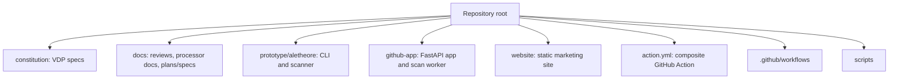
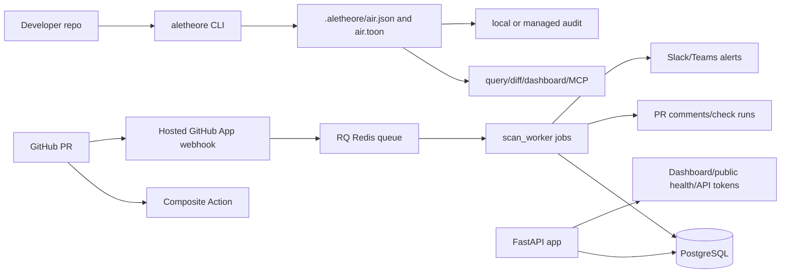
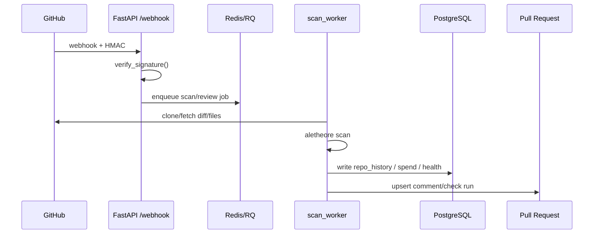
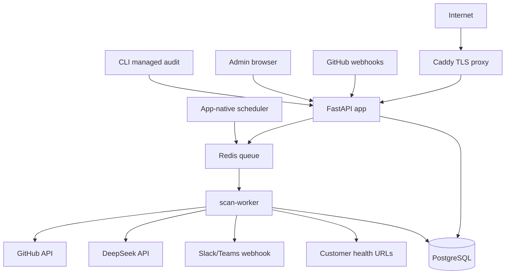
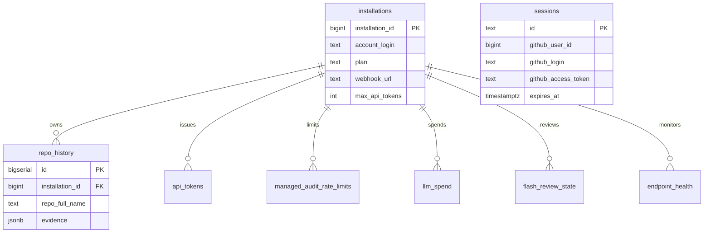
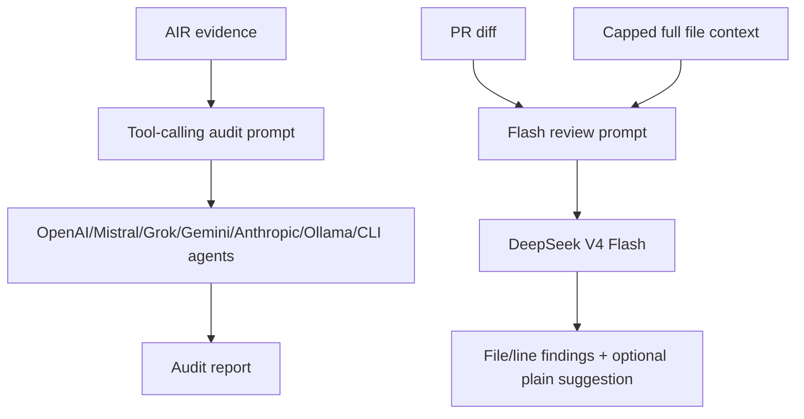

# Startup Technical Due Diligence Audit Report

Project: Veridion / Aletheore  
Audit date: 2026-07-19  
Current status update: 2026-07-23  
Auditor stance: independent technical due diligence  
Repository audited: `/Users/arihantkaul/Documents/GitHub/Veridion`  
Status: Evidence-based repository audit, not a production penetration test  

## Evidence Basis

This report is based only on repository evidence inspected locally. If a capability is not visible in code, tests, configuration, documentation, or checked-in deployment artifacts, this report treats it as missing.

| Evidence Area | Repository Evidence |
|---|---|
| Core product | `prototype/aletheore/*`, `action.yml`, `github-app/*`, `website/*` |
| Governance/spec framework | `constitution/*`, `schemas/vdp.schema.json`, `docs/reviews/*` |
| Tests | `prototype/tests/*`, `github-app/tests/*` |
| Deployment | `github-app/docker-compose.yml`, `github-app/Dockerfile.*`, `github-app/Caddyfile`, `website/vercel.json` |
| CI/CD | `.github/workflows/*`, `.github/dependabot.yml`, `package.json` |
| Current local verification | `prototype`: 643 tests passed. `github-app`: 323 tests passed, 1 skipped. |
| Current hardening branch | `codex/hardening-prelaunch-ci-deploy`, draft PR #15. |

Repository size snapshot:

| Metric | Value |
|---|---:|
| Audited files under `prototype`, `github-app`, `website`, `constitution`, `docs` | 296 |
| Approximate audited lines | 72,977 |
| Python files | 122 |
| Markdown files | 106 |
| SQL migrations | 6 |
| HTML files | 5 |
| Test files | 59 |

## Scoring Legend

| Score | Grade | Meaning |
|---:|---|---|
| 9.0-10 | A | Production mature, enterprise credible |
| 8.0-8.9 | B+/A- | Strong but not yet hardened |
| 7.0-7.9 | B-/B | Viable beta, material gaps |
| 6.0-6.9 | C/C+ | Prototype-plus, not launch-hardened |
| 5.0-5.9 | D | High risk for paid production |
| <5.0 | F | Not acceptable for real users |

---

# 1. Executive Summary

Score: 7.2 / 10  
Grade: B-  
Confidence: 90%  
Priority: Critical  
Business Impact: High  
Engineering Effort: Medium  
Risk Level: Medium-High  
Timeline to Fix: 2-4 weeks for credible paid beta

Aletheore is a real, unusually fast-moving developer-tool product inside the Veridion repository. It has a deterministic scanner, local CLI, semantic search, MCP server, multi-provider AI reporting, GitHub Action, hosted GitHub App scaffold, PR scanning, managed audits, Flash review, Slack/Teams alerts, public health API, website, pricing page, and a substantial test suite.

It is not vaporware. It is now credible for controlled paid beta once the current hardening PR is merged and deployed. It is still not enterprise-hardened enough for broad unattended production use.

The biggest strengths are:

| Strength | Evidence |
|---|---|
| Real deterministic scanner | `prototype/aletheore/evidence.py` wires languages, modules, endpoints, secrets, vulnerabilities, licenses, architecture, dead code, database, infrastructure, and environment evidence. |
| Strong test momentum | Current local verification: `prototype` 643 tests passed, `github-app` 323 tests passed, 1 skipped. |
| Good security instincts | HMAC webhook verification in `github-app/app_server/signature.py`; parameterized DB access; consent prompts before API-based local audits; source-cited Flash review outputs. |
| Clear product differentiation | Website explicitly sells deterministic-first AIR, no LLM in scan path, and hosted GitHub App features. |
| Useful hosted architecture | FastAPI + RQ + Redis + PostgreSQL + Caddy deployment scaffold exists in `github-app/`. |

The biggest remaining weaknesses are:

| Weakness | Evidence |
|---|---|
| Current hardening is not yet merged/deployed | PR #15 contains secret fail-closed, automatic migrations, digest pinning, resource limits, and real quality gates, but must still merge and be deployed. |
| Runtime/server state is not yet independently verified | Local repository evidence is strong; the production server must be inspected before assuming it runs the same commit/configuration. |
| Observability is useful but still basic | Structured JSON logs and internal queue metrics exist; SLOs, dashboards, alert thresholds, and incident ownership are still immature. |
| Backup/restore exists but needs operational proof | Backup and restore scripts/docs exist; a live restore drill and retention policy verification are still needed. |
| Enterprise readiness remains early | Data deletion, SOC 2 path, audit logs, RBAC granularity, customer support process, and formal incident response are not mature. |
| Product claims must stay evidence-scoped | The strongest differentiation depends on consistently resolving every alert, review, audit, and query back to code evidence. |

One-page summary:

| Dimension | Verdict |
|---|---|
| Can this ship today? | For local CLI beta: yes. For controlled hosted paid beta: yes after PR #15 merge/deploy and server verification. Broad enterprise production: no. |
| Investor readiness | Promising technical velocity, but operational maturity is below investable enterprise standard. |
| Startup readiness | Strong founder/product signal; weak compliance, support, observability, and deployment controls. |
| Production readiness | Improving. CI, secret enforcement, URL validation, container hardening, backups, and basic monitoring now exist or are in PR #15; operational proof remains. |
| Technical debt | Manageable if addressed now. Dangerous if postponed while paid hosting grows. |
| Biggest opportunity | Deterministic evidence layer is differentiated and defensible. |
| Biggest risk | A hosted security product with weak ops/security controls loses trust faster than ordinary SaaS. |

---

# 2. Repository Overview

Score: 7.1 / 10  
Grade: B-  
Confidence: 90%  
Priority: High  
Business Impact: High  
Engineering Effort: Medium  
Risk Level: Medium-High  
Timeline to Fix: 2-5 weeks

## Project Structure



## Technology Stack

| Area | Stack | Evidence |
|---|---|---|
| CLI/scanner | Python 3.11+, Typer, Rich, tree-sitter, networkx, LanceDB, MCP | `prototype/pyproject.toml` |
| Hosted app | FastAPI, asyncpg, psycopg, Redis, RQ, PyJWT, cryptography | `github-app/requirements.txt` |
| Storage | PostgreSQL JSONB history, sessions, tokens, spend, endpoint health | `github-app/migrations/*.sql` |
| Worker | RQ jobs, GitHub API, local clone/scan/audit workflows | `github-app/scan_worker/jobs.py` |
| Website | Static HTML/CSS/JS on Vercel | `website/*`, `website/vercel.json` |
| CI | GitHub Actions | `.github/workflows/*` |
| Deployment | Docker Compose, Caddy, Postgres, Redis, app-native scheduler | `github-app/docker-compose.yml`, `github-app/scan_worker/scheduler.py` |

## Architecture Diagram



## Maintainability Assessment

| Area | Assessment |
|---|---|
| Folder organization | Clear enough: specs, prototype, hosted app, website are separated. |
| Layering | Prototype and hosted app boundaries are understandable, but shared code reuse is ad hoc. |
| Build system | Python package exists; root `package.json` now runs real formatting, Markdown, spelling, link, and license checks. |
| Deployment | Docker Compose exists with non-root app/worker containers, app-native scheduler, digest-pinned Python bases in PR #15, and resource limits in PR #15. |
| CI/CD | Prototype and GitHub App test workflows exist; quality workflows now run real checks in PR #15. |
| Governance docs | Stronger than typical early repos; VDP system is extensive. |

---

# 3. Codebase Review

Score: 6.8 / 10  
Grade: C+  
Confidence: 86%  
Priority: High  
Business Impact: High  
Engineering Effort: Medium  
Risk Level: Medium-High  
Timeline to Fix: 3-6 weeks

## Key Findings

| ID | Severity | Location | Explanation | Recommendation | Effort | Score |
|---|---|---|---|---|---:|---:|
| CODE-001 | Resolved | `.github/workflows/github-app-tests.yml` | Hosted app tests are now gated with PostgreSQL/Redis services and coverage threshold. | Keep CI green and extend with marketplace/deploy smoke tests. | 1-2d | 8/10 |
| CODE-002 | Resolved in PR #15 | `github-app/app_server/config.py` | Required secrets now fail startup when missing or blank, including the GitHub App private key. | Merge and deploy PR #15; verify production env contains non-empty secrets. | 1d | 8/10 |
| CODE-003 | Resolved | `github-app/app_server/admin.py`, `url_validation.py` | Webhook and health-check URLs now use Pydantic bodies and external HTTPS validation with private/loopback/link-local denial. | Add DNS rebinding/pinning policy if health checks become high-risk enterprise surface. | 2-4d | 8/10 |
| CODE-004 | Medium | `prototype/aletheore/cli.py` | CLI is a large 900+ line module with command routing, UX, adapters, scanning, and health logic. | Split command groups into `commands/*.py` after stabilizing behavior. | 3-5d | 6/10 |
| CODE-005 | Medium | `prototype/aletheore/cli.py` | The CLI top-level import and command surface remains large and startup-sensitive despite recent lazy-loading improvements. | Add import-time regression tests and split stable command groups after behavior settles. | 1-2d | 6/10 |
| CODE-006 | Medium | `github-app/scan_worker/jobs.py` | Worker job file mixes clone, scan, PR comment, audit, spend, Flash review, health sweep. | Split job orchestration from GitHub/comment/rendering/spend policy. | 3-7d | 6/10 |
| CODE-007 | Medium | `prototype/aletheore/secrets.py` | Secret detector is regex-based and intentionally simple. | Keep deterministic scanner but add entropy and allowlist rigor. | 3-5d | 6/10 |
| CODE-008 | Medium | `prototype/aletheore/report.py` | Agent invocation can let local CLI agents write files in audited repo. | Make write permissions explicit by adapter type; document trust boundary. | 2-4d | 6/10 |
| CODE-009 | Resolved | `github-app/app_server/managed_audit_api.py` | Managed-audit input now uses `StartManagedAuditRequest`, evidence size limits, TOON decode validation, and authenticated status polling. | Add API schema export and client contract tests before broad API launch. | 1-2d | 8/10 |
| CODE-010 | Resolved in PR #15 | Root `package.json` | Quality scripts now run actual tooling instead of TODO echo commands. | Install CI-provided tools where local shortcuts depend on external binaries. | 1d | 8/10 |

## Improved Implementation Examples

### Before: permissive production settings

```python
github_webhook_secret=os.environ.get("GITHUB_WEBHOOK_SECRET", "")
session_secret=os.environ.get("SESSION_SECRET", "")
```

### After: fail closed

```python
def _required_env(name: str) -> str:
    value = os.environ.get(name, "").strip()
    if not value:
        raise RuntimeError(f"{name} is required")
    return value

github_webhook_secret=_required_env("GITHUB_WEBHOOK_SECRET")
session_secret=_required_env("SESSION_SECRET")
```

### Before: unvalidated admin URL

```python
await set_webhook_url(pool, installation_id, body.get("webhook_url"))
```

### After: constrained URL parsing

```python
from pydantic import AnyHttpUrl, BaseModel

class WebhookUrlRequest(BaseModel):
    webhook_url: AnyHttpUrl | None

payload = WebhookUrlRequest.model_validate(await request.json())
await set_webhook_url(pool, installation_id, str(payload.webhook_url) if payload.webhook_url else None)
```

---

# 4. Architecture Review

Score: 6.7 / 10  
Grade: C+  
Confidence: 85%  
Priority: High  
Business Impact: High  
Engineering Effort: Medium-High  
Risk Level: High  
Timeline to Fix: 4-8 weeks

## Architecture Assessment

| Topic | Assessment | Evidence |
|---|---|---|
| Monolith vs services | Sensible small-service split: app server and worker. | `github-app/docker-compose.yml` |
| Event-driven processing | RQ queue isolates webhook request path from scan work. | `github-app/app_server/webhooks/*`, `scan_worker/jobs.py` |
| Data model | Simple JSONB history plus normalized operational tables. | `github-app/migrations/*.sql` |
| Scalability | Worker and app can scale conceptually, but no resource limits, queue partitioning, or autoscaling. | Docker Compose only. |
| API design | REST-ish, minimal models, limited schema validation. | `app_server/*.py` |
| Caching | No explicit cache layer except persisted recent history. | No cache code found. |
| Rate limiting | Repo-size cooldown and spend caps exist for managed audits. | `app_server/rate_limit.py`, `scan_worker/jobs.py` |
| Versioning | Public APIs are `/v1`, good start. | `managed_audit_api.py`, `dashboard.py` |

## Data Flow



## Architecture Gaps

| Gap | Risk | Fix |
|---|---|---|
| No service-level boundaries documented | New engineers will struggle to reason about ownership. | Add `docs/architecture/hosted-app.md`. |
| No queue failure/retry policy documented | Failed jobs may silently degrade customer trust. | Define retry, dead-letter, and alerting behavior. |
| No multitenancy threat model | Hosted app stores multiple installations in one DB. | Add tenant isolation review and tests. |
| No environment separation | Docker Compose is a single deployment path. | Add staging/prod config model. |

---

# 5. Security Audit

Score: 5.9 / 10  
Grade: D+  
Confidence: 84%  
Priority: Critical  
Business Impact: Critical  
Engineering Effort: Medium  
Risk Level: High  
Timeline to Fix: 2-6 weeks

## Security Strengths

| Strength | Evidence |
|---|---|
| GitHub webhook HMAC verification | `github-app/app_server/signature.py` uses HMAC SHA-256 and `compare_digest`. |
| Session cookies are `httponly`, `secure`, `samesite=lax` | `github-app/app_server/auth.py:100-106`, `:159-165`. |
| GitHub access tokens encrypted at rest | `auth.py:24-33`, `:149-155`. |
| CLI consent before sending evidence to API adapters | `prototype/aletheore/cli.py:258-266`, `:438-444`. |
| API token hashes stored instead of raw tokens | `github-app/app_server/admin.py:109-112`. |

## Vulnerability Findings

| ID | Severity | CVSS Est. | Location | Business Impact | Attack Scenario | Proof | Fix |
|---|---|---:|---|---|---|---|---|
| SEC-001 | Resolved in PR #15 | 9.1 | `github-app/app_server/config.py` | Empty secrets can invalidate auth/HMAC/session trust. | Misconfigured production boots with blank `SESSION_SECRET` or webhook secret. | Required secrets fail closed when missing/blank; private key path rejects empty files. | Merge/deploy PR #15 and verify production env. |
| SEC-002 | Resolved | 8.1 | `github-app/app_server/admin.py`, `url_validation.py` | SSRF and internal network probing through health checks; webhook misuse. | Admin or compromised account sets health URL to metadata/internal host. Worker periodically calls it. | Admin bodies are Pydantic-validated; URLs must be HTTPS and resolve outside private/loopback/link-local/reserved ranges. | Add DNS rebinding controls if threat model requires stronger guarantees. |
| SEC-003 | Resolved | 8.0 | `github-app/docker-compose.yml`, `scan_worker/scheduler.py` | Container breakout risk via Docker socket. | Scheduler compromise can enumerate/control Docker API if the socket is mounted. | Ofelia and Docker socket mount have been removed; scheduler runs as an app-native worker process. | Verify deployed server no longer runs Ofelia or mounts Docker socket. |
| SEC-004 | Resolved in PR #15 | 7.8 | Dockerfiles | Root containers increase blast radius. | RCE in app/worker runs as root inside container. | App server and scan worker Dockerfiles create/use non-root `aletheore` user. | Add read-only filesystem/tmpfs where feasible. |
| SEC-005 | Resolved | 7.4 | `managed_audit_api.py` | Any caller with job ID can poll result. | Guess/leak job id exposes audit output. | Status endpoint authenticates bearer token and checks job installation ownership. | Add audit logging for denied status probes. |
| SEC-006 | Medium | 6.5 | OAuth callback | Direct install flow bypasses state when cookie absent. | CSRF risk depends GitHub flow details; not enough evidence to prove exploit. | Comment explicitly allows no-state callback. | Separate install callback path or bind nonce through GitHub setup URL where possible. |
| SEC-007 | Medium | 6.4 | `action.yml:64-66` | Supply-chain risk in composite action install. | Pull request action installs local package plus dependencies from indexes. | `pip install` without hashes. | Use constraints/lock/hashes for Action runtime dependencies. |
| SEC-008 | Medium | 6.3 | `prototype/aletheore/adapters/*` | Local agent adapters execute third-party CLI tools over repo content. | Malicious repo content prompt-injects local agent with write access. | Adapters call `claude`, `codex`, `gemini`, etc.; `codex` uses workspace-write. | Make trust boundary explicit and default to read-only where available. |
| SEC-009 | Medium | 6.0 | `prototype/aletheore/search_index.py` | Embedding fallback may send code chunks to OpenAI. | User expects local-only; fallback sends retrieved text if key exists and user consents through prompt path. | Website claims local vector index; code has OpenAI fallback. | Make fallback opt-in by flag, not implicit. |
| SEC-010 | Medium | 5.9 | `github-app/.env.example` | Weak example credentials can become real in small deployments. | Operator leaves `POSTGRES_PASSWORD=changeme`. | `.env.example` includes `changeme`. | Use obvious invalid sentinel and startup validation. |

## Attack Surface Diagram



## Secure Code Example: URL Validation

```python
import ipaddress
import socket
from urllib.parse import urlparse

def validate_external_https_url(raw: str) -> str:
    parsed = urlparse(raw)
    if parsed.scheme != "https":
        raise ValueError("URL must be https")
    addresses = socket.getaddrinfo(parsed.hostname, None)
    for entry in addresses:
        ip = ipaddress.ip_address(entry[4][0])
        if ip.is_private or ip.is_loopback or ip.is_link_local:
            raise ValueError("internal addresses are not allowed")
    return raw
```

---

# 6. Backend Review

Score: 7.1 / 10  
Grade: B-  
Confidence: 86%  
Priority: High  
Business Impact: High  
Engineering Effort: Medium  
Risk Level: Medium-High  
Timeline to Fix: 3-6 weeks

| Topic | Review |
|---|---|
| Controllers | FastAPI routers now use Pydantic models for key admin and managed-audit request bodies; response models are still limited. |
| Services | Service logic is mostly inline in routes/jobs. |
| Repositories | DB helper modules exist; async and sync implementations diverge manually. |
| Transactions | Important history and cooldown operations use transactions/atomic SQL. |
| Validation | Improved: admin/API endpoints validate labels, URL schemes/hosts, evidence size, TOON decoding, and ownership-sensitive inputs. |
| Error handling | Good in tests for common paths; production exceptions likely under-observed. |
| Caching | Not found. |
| Async tasks | RQ used appropriately for long scans/reviews. |
| Logging | Structured JSON logging exists for app/worker paths; dashboarding/alerting remains open. |
| Metrics | Internal queue metrics endpoint exists; broader Prometheus/OpenTelemetry coverage remains open. |
| Health checks | Product health monitoring and app health endpoint exist; production smoke checks are still needed. |

## Backend ERD



## Backend Recommendations

| Priority | Recommendation | Why |
|---|---|---|
| P0 | Add Pydantic models for every POST/PUT body. | Eliminates KeyError 500s and bad state writes. |
| P0 | Authenticate managed-audit status endpoint. | Prevents job-result disclosure. |
| P1 | Consolidate async/sync DB APIs or generate shared SQL. | Reduces drift between app and worker. |
| P1 | Add structured logging with request/job IDs. | Required for incidents. |
| P2 | Add API version contract docs. | Required before external developers depend on it. |

---

# 7. Frontend Review

Score: 6.2 / 10  
Grade: C  
Confidence: 78%  
Priority: Medium  
Business Impact: Medium  
Engineering Effort: Low-Medium  
Risk Level: Medium  
Timeline to Fix: 2-4 weeks

The checked-in frontend is primarily a static marketing site. No full hosted dashboard UI was found in `website/`; dashboard endpoints return JSON from FastAPI.

| Topic | Assessment | Evidence |
|---|---|---|
| UI/UX | Website has clear founder voice and product claims. | `website/index.html` |
| Accessibility | Basic alt text exists for logo images, but no automated a11y checks were found. | `website/index.html` |
| Responsiveness | CSS exists, but no visual regression tests found. | `website/styles.css` |
| State management | Not applicable for static site. |
| SEO | Titles/descriptions and sitemap/robots exist. | `website/*.html`, `website/sitemap.xml`, `website/robots.txt` |
| Forms | No production forms found. |
| Dashboard UI | Not enough evidence; API returns JSON, no rich app UI found in `github-app`. |

## Frontend Recommendations

| Priority | Recommendation | Effort |
|---|---|---:|
| P1 | Add Playwright smoke tests for homepage/pricing responsive rendering. | 2d |
| P1 | Add accessibility scan in CI. | 1d |
| P2 | Build actual hosted dashboard UI if product claims depend on it. | 1-2w |
| P2 | Replace generic Marketplace link after listing approval. | 0.5d |

---

# 8. Database Review

Score: 7.0 / 10  
Grade: B-  
Confidence: 84%  
Priority: High  
Business Impact: High  
Engineering Effort: Medium  
Risk Level: Medium-High  
Timeline to Fix: 3-6 weeks

## Schema Assessment

| Area | Finding |
|---|---|
| Schema simplicity | Good early schema with installations, repo history, tokens, sessions, spend, health. |
| Indexing | Basic indexes exist for repo history, tokens, endpoint health. |
| JSONB history | Flexible but can grow quickly; no archival strategy found. |
| Sessions | Stored in DB with expiry, but no cleanup job found. |
| API tokens | Has revocation and active-token partial index. |
| Backups | Backup and restore scripts/docs exist; live restore drill and PITR policy still need operational proof. |
| Migrations | SQL files and an idempotent migration runner exist; PR #15 wires app-server startup to run it before serving traffic. |

## Database Risks

| Risk | Evidence | Fix |
|---|---|---|
| Migration runner must be operationally verified | Compose still mounts migrations for first initialization; PR #15 also runs `scripts/migrate.py` before app-server startup. | Deploy PR #15 and verify migration logs on the server. |
| Repo evidence JSONB can be large and expensive | `repo_history.evidence JSONB NOT NULL`; keep=20 in app helpers. | Add size monitoring, compression strategy, and archival. |
| No tenant-level row security | All tenant isolation is application-layer. | Add explicit ownership tests and consider RLS if enterprise. |
| Backup strategy needs drill evidence | `scripts/backup-postgres.sh`, `scripts/restore-postgres.sh`, and README docs exist. | Run and record a restore drill on the server; define PITR/retention expectations. |

---

# 9. DevOps Review

Score: 7.0 / 10  
Grade: B-  
Confidence: 88%  
Priority: Critical  
Business Impact: Critical  
Engineering Effort: Medium  
Risk Level: Medium-High  
Timeline to Fix: 1-3 weeks

## DevOps Findings

| ID | Severity | Location | Explanation | Fix |
|---|---|---|---|---|
| DEVOPS-001 | Resolved | `.github/workflows/github-app-tests.yml` | Hosted app tests run in CI with PostgreSQL/Redis services and coverage gate. | Keep coverage meaningful as app grows. |
| DEVOPS-002 | Resolved in PR #15 | `.github/workflows/*.yml` | Formatting, markdown, license, link, and spell checks now execute real tooling. | Watch first CI run for external link/license false positives. |
| DEVOPS-003 | Resolved in PR #15 | Dockerfiles | App/worker images run as non-root and Python bases are digest-pinned. | Add image vulnerability scanning/SBOM next. |
| DEVOPS-004 | Resolved in PR #15 | `docker-compose.yml` | App server and scan worker have CPU/memory limits. | Confirm limits on deployed host. |
| DEVOPS-005 | Resolved | `docker-compose.yml`, `scan_worker/scheduler.py` | App-native scheduler replaces the Docker-socket scheduler. | Confirm deployed host no longer runs Ofelia. |
| DEVOPS-006 | Partially resolved | `github-app/README.md` | Rollback and backup docs exist; no live deploy drill record yet. | Run a server deploy/rollback rehearsal and document results. |
| DEVOPS-007 | Partially resolved | PostgreSQL scripts/docs | Backup and restore scripts exist; restore drill not yet evidenced. | Run restore drill and record retention/PITR expectations. |
| DEVOPS-008 | Resolved | `.github/dependabot.yml` | Dependabot covers GitHub Actions, root npm, prototype pip, and github-app pip. | Add grouped update policy if PR noise becomes high. |

---

# 10. AI/ML Review

Score: 6.9 / 10  
Grade: B-  
Confidence: 83%  
Priority: High  
Business Impact: High  
Engineering Effort: Medium  
Risk Level: Medium-High  
Timeline to Fix: 3-6 weeks

## AI Architecture



## AI Strengths

| Strength | Evidence |
|---|---|
| Deterministic scan separated from LLM reporting | Website and `prototype/aletheore/evidence.py` show scanner produces AIR first. |
| Tool-calling report contract | `prototype/aletheore/adapters/openai_compatible.py` defines required sections and evidence tools. |
| Prompt-injection awareness | Evidence tool results are wrapped and explicitly treated as data. |
| Flash review output validation | `github-app/scan_worker/flash_review.py` validates JSON list and exact file/line/issue fields. |
| Context caps | `github-app/scan_worker/github_api.py` defines 15 files, 40k bytes/file, 200k total. |

## AI Risks

| Risk | Severity | Explanation | Fix |
|---|---|---|---|
| Prompt injection from repository evidence | High | Manual instructions help, but external CLI agents may still act on repo content. | Add adversarial prompt-injection tests and read-only modes. |
| Hallucinated report claims | Medium | Tool contract helps but no automated report verifier found. | Validate report citations back to AIR fields. |
| Cost blowups | Medium | Spend caps exist; context caps exist; but no dashboard budget alerts found. | Add cost alerting and per-job token logs. |
| Model availability/quality drift | Medium | Models are named in code; behavior can change. | Add model conformance tests with recorded fixtures. |
| Privacy clarity | Medium | Some paths send derived evidence/code chunks to providers. | Make data-transfer matrix explicit in docs and CLI UX. |

---

# 11. Performance Review

Score: 6.3 / 10  
Grade: C  
Confidence: 78%  
Priority: Medium  
Business Impact: Medium-High  
Engineering Effort: Medium  
Risk Level: Medium  
Timeline to Fix: 3-8 weeks

| Area | Current State | Risk |
|---|---|---|
| Scanner CPU | Tree-sitter and graph analysis are local and likely CPU-bound. | Large repos may exceed CI/worker time budgets. |
| License/vulnerability lookups | Network calls use timeouts; dependency checks can be many external requests. | Slow scans and rate limiting. |
| Git history scanning | Streaming git log avoids full in-memory history. | Still expensive on very large histories. |
| Hosted worker | RQ serial workers by default; no autoscaling config found. | Queue backlog under usage spikes. |
| Database | JSONB history retained 20 entries. | Large evidence payloads may affect dashboard latency. |
| Website | Static site, low risk. | No Lighthouse/a11y/perf CI found. |

## Performance Recommendations

| Priority | Recommendation | Effort |
|---|---|---:|
| P0 | Add max scan duration and worker timeout policy per job type. | 2d |
| P1 | Cache dependency license/vulnerability lookups by package/version. | 1w |
| P1 | Store evidence summaries separately from full JSONB. | 1w |
| P2 | Add benchmark suite for Kubernetes/Django/Express fixtures. | 1w |
| P2 | Add queue depth and job duration metrics. | 2-3d |

---

# 12. Testing Review

Score: 8.0 / 10  
Grade: B+  
Confidence: 92%  
Priority: High  
Business Impact: High  
Engineering Effort: Medium  
Risk Level: Medium  
Timeline to Fix: 2-4 weeks

## Test Evidence

| Suite | Current Result |
|---|---|
| `prototype` | 643 passed |
| `github-app` | 323 passed, 1 skipped |
| Test files | 59 |

## Test Strengths

| Strength | Evidence |
|---|---|
| Broad scanner parser coverage | `prototype/tests/test_graph_*.py`, `test_endpoints.py`, `test_detect.py` |
| Hosted app route/job tests | `github-app/tests/test_*.py` |
| Security-specific tests | `test_signature.py`, `test_auth.py`, `test_rate_limit.py`, `test_secrets.py` |
| Recent regression tests | Flash suggestion safety and health alert source locations are covered. |
| CI coverage gates | Prototype and GitHub App workflows publish coverage XML and enforce minimum coverage. |

## Test Gaps

| Gap | Impact | Fix |
|---|---|---|
| Production deployment smoke tests are limited | High | Add post-deploy smoke checks against the real hosted server. |
| Marketplace/install lifecycle E2E needs expansion | Medium | Add end-to-end install, purchase, scan, and cancellation scenarios. |
| E2E production-flow test exists but should broaden | Medium | Extend webhook -> queue -> worker -> comment coverage beyond the current mocked path. |
| No browser visual tests | Medium | Add Playwright for website/dashboard. |
| No chaos/failure tests for Redis/Postgres outage | Medium | Add worker resilience tests. |

---

# 13. Startup Review

Score: 7.0 / 10  
Grade: B-  
Confidence: 78%  
Priority: High  
Business Impact: High  
Engineering Effort: Medium-High  
Risk Level: Medium-High  
Timeline to Fix: 6-12 weeks

| VC Lens | Verdict |
|---|---|
| Product quality | Strong prototype with real differentiation. |
| Differentiation | Deterministic AIR plus LLM reporting is a credible angle. |
| Market fit | Security/code-review/devex market is large but crowded. |
| Technical moat | Scanner coverage and evidence model could become moat; currently not enough proprietary depth. |
| Competition | Competes with Snyk, Semgrep, CodeQL, Sonar, GitHub Advanced Security, AI reviewers. |
| Scalability | Architecture can scale but deployment maturity is weak. |
| Hiring readiness | Codebase is understandable but needs docs and module boundaries. |
| Enterprise readiness | Not yet. Compliance/security controls missing. |
| Would fund? | Seed-stage maybe, conditional on hardening plan. |
| Would use? | CLI yes for technical users; hosted app only after security/ops fixes. |

## Startup Thesis

Aletheore has a real wedge: "AI review that can show its work" is more credible than generic AI code review. The risk is that evidence quality has to stay meaningfully better than incumbents, and the hosted product must not create security distrust.

---

# 14. Business Review

Score: 6.5 / 10  
Grade: C+  
Confidence: 73%  
Priority: High  
Business Impact: High  
Engineering Effort: Medium  
Risk Level: Medium-High  
Timeline to Fix: 4-10 weeks

| Area | Assessment |
|---|---|
| Business model | Free CLI/GitHub Action plus Pro hosted audits at $11.99/mo up to 3 members. |
| Monetization | Low price may not cover LLM/support costs for heavy repos. |
| Retention | PR comments/check runs can drive habit. |
| Virality | GitHub PR comments expose value to teams. |
| Market risks | Crowded developer security/review tooling. |
| Enterprise readiness | Weak: no SOC 2 path, DPA, SSO/SAML, audit logging, RBAC granularity found. |
| Pricing risk | Seat price may not map to repo size/LLM cost. |

## Business Recommendations

| Priority | Recommendation |
|---|---|
| P0 | Add cost model by repo size and usage before scaling Pro. |
| P0 | Publish security/data-handling policy for hosted product. |
| P1 | Add enterprise roadmap: SSO, audit logs, retention controls, data deletion. |
| P1 | Instrument activation funnel: install -> first PR comment -> audit -> retained weekly usage. |

---

# 15. Production Readiness

Score: 6.7 / 10  
Grade: C+  
Confidence: 87%  
Priority: Critical  
Business Impact: Critical  
Engineering Effort: Medium-High  
Risk Level: High  
Timeline to Fix: 4-8 weeks

| Capability | Found? | Evidence / Gap |
|---|---|---|
| Monitoring | Partial | Product endpoint monitoring and internal queue metrics exist; dashboards and alert thresholds are not yet productionized. |
| Alerting | Partial | Slack/Teams for findings/health; infra/platform alert ownership still needs definition. |
| Incident response | No | No formal incident response runbook found. |
| Structured logging | Yes | `app_server/logging_config.py` and worker setup emit structured JSON logs with request/job context. |
| Recovery | Partial | Backup/restore scripts and rollback docs exist; live restore drill evidence is still missing. |
| Scaling | Partial | App/worker services exist with PR #15 resource limits; no autoscaling or queue priority model. |
| Backups | Partial | Backup and restore scripts/docs exist; PITR and restore drill need confirmation. |
| Disaster recovery | Partial | Rollback and restore paths are documented, but no tested DR record exists. |
| SLAs | No | No SLO/SLA docs found. |
| Security | Partial | HMAC/session basics, secret fail-closed, URL validation, authenticated status polling, and container hardening exist; enterprise controls remain immature. |

Production verdict: controlled hosted paid beta is reasonable after PR #15 is merged/deployed and the server state is verified. Broad enterprise production still requires operational proof, incident/data policies, and compliance controls.

---

# 16. Documentation Review

Score: 7.2 / 10  
Grade: B-  
Confidence: 86%  
Priority: Medium  
Business Impact: Medium  
Engineering Effort: Low-Medium  
Risk Level: Medium  
Timeline to Fix: 2-4 weeks

| Area | Assessment |
|---|---|
| README | Exists for repo and prototype. |
| Governance docs | Extensive VDP/constitution docs exist. |
| Architecture docs | Processor specs strong; hosted app architecture docs weak. |
| Deployment docs | `github-app/README.md` exists; production runbooks incomplete. |
| API docs | Minimal; OpenAPI exists implicitly via FastAPI but not documented. |
| Security docs | General `SECURITY.md` exists; hosted data policy insufficient. |
| Onboarding | Reasonable for contributors, incomplete for operators. |

---

# 17. Risk Register

| Risk | Severity | Likelihood | Impact | Recommendation |
|---|---|---|---|---|
| PR #15 not deployed | High | Medium | Local hardening not active in production | Merge PR #15 and deploy after review. |
| Server state unknown | High | Medium | Production may be running stale code/config | Inspect host, current commit, compose services, env shape, and containers before changes. |
| No restore drills | High | Medium | Failed recovery | Test restore monthly and record evidence. |
| Backup/PITR policy immature | High | Medium | Data loss beyond basic dumps | Define retention, off-host copy, and PITR posture. |
| Observability not productionized | High | Medium | Incident blindness | Convert logs/metrics into dashboards and alerts. |
| No SLOs | Medium | High | Undefined reliability | Define SLOs and alert thresholds. |
| No incident response runbook | High | Medium | Slow recovery | Add incident roles, severity levels, escalation, and customer comms. |
| No image vulnerability scanning | High | Medium | Vulnerable container releases | Add Trivy/Grype or equivalent CI gate. |
| No SBOM generation | Medium | Medium | Weak supply-chain evidence | Add CycloneDX/Syft artifact generation. |
| No billing/cost dashboard | Medium | Medium | LLM cost overrun | Add cost metrics/alerts. |
| Prompt injection | High | Medium | Bad AI output/actions | Add adversarial tests. |
| CLI agent write access | Medium | Medium | Repo mutation | Default read-only where possible. |
| Composite Action supply chain | Medium | Medium | CI compromise | Pin deps/hashes. |
| No enterprise data policy | High | Medium | Lost deals | Publish hosted data handling. |
| Static site no a11y tests | Low | Medium | UX/legal friction | Add accessibility checks. |
| No staging/prod split docs | Medium | Medium | Bad deployments | Add env model. |
| Public health CORS wildcard | Medium | Medium | Data exposure by design | Document or add opt-in visibility. |
| JSONB evidence growth | Medium | High | DB bloat | Compress/archive summaries. |
| No support process | Medium | Medium | Customer churn | Add support runbook. |
| Marketplace status pending | Medium | High | Acquisition friction | Finish review/listing. |
| No compliance roadmap | High | Medium | Enterprise blockers | Define SOC 2 path. |

---

# 18. Technical Debt Register

| Priority | Debt | Cost | Benefit | Est. Weeks | Dependencies |
|---|---|---:|---|---:|---|
| P0 | Merge/deploy PR #15 | Low | Activates current hardening in production | 0.25 | Review |
| P0 | Server state verification | Low | Prevents wrong-host or stale-deploy assumptions | 0.25 | SSH read-only inspection |
| P0 | Restore drill evidence | Medium | Proves production survivability | 0.5 | Backup scripts |
| P0 | Incident response runbook | Low | Defines outage handling | 0.5 | Operator owner |
| P1 | Worker mega-module | Medium | Maintainability | 1 | Test coverage |
| P1 | CLI mega-module | Medium | Maintainability | 1 | Test coverage |
| P1 | Productionized observability | Medium | Incident response | 1-2 | Metrics/log stack |
| P1 | Image vulnerability scanning and SBOM | Medium | Supply-chain assurance | 0.5 | CI tool choice |
| P2 | Static site no visual tests | Low | Brand trust | 0.5 | Playwright |

---

# 19. Roadmap

## 30 Days

| Milestone | Outcome |
|---|---|
| Production guardrails | Required env validation, URL validation, authenticated job status. |
| CI completeness | Prototype + GitHub App tests in CI, real lint/format/license checks. |
| Container hardening | Non-root images, remove/replace Docker socket scheduler. |
| Backup runbook | Automated PostgreSQL backup and restore rehearsal. |

## 60 Days

| Milestone | Outcome |
|---|---|
| Observability | Structured logs, metrics, queue dashboards, basic alerts. |
| Migration system | Repeatable migrations outside initdb. |
| Hosted dashboard | Real UI for installations/history/health/spend. |
| Data handling docs | Privacy/security policy for hosted evidence. |

## 90 Days

| Milestone | Outcome |
|---|---|
| Enterprise beta | Audit logs, retention settings, support process. |
| Performance benchmarks | Published scan timings for large repos. |
| Report verifier | Automated evidence citation checks. |

## 6 Months

| Milestone | Outcome |
|---|---|
| Compliance track | SOC 2 readiness artifacts, vendor risk package. |
| Scale architecture | Autoscaling workers, queue priorities, caching. |
| Team onboarding | Maintainer docs, runbooks, architecture docs. |

## 12 Months

| Milestone | Outcome |
|---|---|
| Enterprise product | SSO/SAML, RBAC, org-level settings, SLAs. |
| Defensive moat | Deep evidence graph quality, better static analysis, benchmark credibility. |

---

# 20. Top 100 Improvements Ranked by ROI

| Rank | Improvement | Priority | Impact | Difficulty | Time | ROI |
|---:|---|---|---|---|---|---|
| 1 | Add GitHub App test workflow with Postgres | Resolved | Critical | Low | 1d | Very High |
| 2 | Fail startup on missing secrets | Resolved in PR #15 | Critical | Low | 0.5d | Very High |
| 3 | Validate health-check URLs against SSRF | Resolved | Critical | Medium | 2d | Very High |
| 4 | Authenticate managed-audit job status | Resolved | High | Low | 1d | Very High |
| 5 | Add PostgreSQL backup script and restore docs | Partially resolved | Critical | Medium | 3d | Very High |
| 6 | Remove Docker socket scheduler dependency | Resolved | High | Medium | 3d | Very High |
| 7 | Run containers as non-root | Resolved in PR #15 | High | Low | 1d | Very High |
| 8 | Replace placeholder CI workflows | Resolved in PR #15 | High | Low | 2d | Very High |
| 9 | Add pip Dependabot for prototype/github-app | Resolved | High | Low | 0.5d | Very High |
| 10 | Add Pydantic request models | Resolved | High | Medium | 3d | High |
| 11 | Add structured JSON logging | Resolved | High | Medium | 3d | High |
| 12 | Add queue/job metrics | Partially resolved | High | Medium | 3d | High |
| 13 | Add deployment rollback runbook | Partially resolved | High | Low | 1d | High |
| 14 | Add migration runner | Resolved in PR #15 | High | Medium | 4d | High |
| 15 | Add platform health endpoint | Resolved | Medium | Low | 1d | High |
| 16 | Add scan timeout policy | P1 | Medium | Low | 1d | High |
| 17 | Add evidence payload size limits | Resolved | High | Medium | 2d | High |
| 18 | Add managed audit input size cap | Resolved | High | Medium | 2d | High |
| 19 | Add API token label validation | Resolved | Medium | Low | 0.5d | High |
| 20 | Add session cleanup job | Resolved | Medium | Low | 1d | High |
| 21 | Add health-check URL allow/deny docs | Partially resolved | High | Low | 1d | High |
| 22 | Add Slack/Teams webhook URL validation | Resolved | High | Low | 1d | High |
| 23 | Add CI coverage report | Resolved | Medium | Medium | 2d | High |
| 24 | Add minimum coverage threshold | Resolved | Medium | Low | 1d | High |
| 25 | Add e2e webhook-to-comment test | Partially resolved | High | Medium | 4d | High |
| 26 | Add Flash review adversarial prompt tests | P1 | Medium | Medium | 2d | High |
| 27 | Add report citation verifier | P1 | High | High | 1w | High |
| 28 | Split `scan_worker/jobs.py` | P1 | Medium | Medium | 1w | Medium |
| 29 | Split `prototype/aletheore/cli.py` | P1 | Medium | Medium | 1w | Medium |
| 30 | Document hosted architecture | P1 | Medium | Low | 1d | High |
| 31 | Document data retention | P1 | High | Low | 1d | High |
| 32 | Document incident response | P1 | High | Low | 1d | High |
| 33 | Add production checklist | P1 | High | Low | 1d | High |
| 34 | Add cost dashboard | P1 | Medium | Medium | 1w | Medium |
| 35 | Alert on LLM spend threshold | P1 | Medium | Medium | 2d | High |
| 36 | Add queue dead-letter policy | P1 | Medium | Medium | 3d | Medium |
| 37 | Add retry policy docs/tests | P1 | Medium | Medium | 3d | Medium |
| 38 | Add health sweep timeout config | P1 | Medium | Low | 1d | High |
| 39 | Add outbound HTTP timeout consistency | P1 | Medium | Low | 1d | High |
| 40 | Add dependency license cache | P2 | Medium | Medium | 1w | Medium |
| 41 | Add OSV result cache | P2 | Medium | Medium | 1w | Medium |
| 42 | Add scan benchmark harness | P2 | Medium | Medium | 1w | Medium |
| 43 | Add Playwright website smoke tests | P2 | Medium | Low | 2d | Medium |
| 44 | Add accessibility CI | P2 | Medium | Low | 1d | Medium |
| 45 | Add Lighthouse CI | P2 | Low | Medium | 2d | Medium |
| 46 | Pin Docker image digests | P1 | High | Low | 1d | High |
| 47 | Add SBOM generation | P1 | Medium | Medium | 2d | Medium |
| 48 | Add image vulnerability scanning | P1 | High | Medium | 2d | High |
| 49 | Add pip hash constraints for Action | P1 | Medium | Medium | 2d | Medium |
| 50 | Add release signing/provenance | P2 | Medium | Medium | 3d | Medium |
| 51 | Add `SECURITY.md` hosted disclosure details | P1 | High | Low | 1d | High |
| 52 | Replace TODO issue templates | P2 | Low | Low | 1d | Medium |
| 53 | Formalize CODEOWNERS | P1 | Medium | Low | 0.5d | High |
| 54 | Add branch protection docs | P1 | Medium | Low | 0.5d | High |
| 55 | Add repo ruleset documentation | P2 | Medium | Low | 1d | Medium |
| 56 | Add staged environment config | P1 | High | Medium | 3d | High |
| 57 | Add SLO definitions | P1 | Medium | Low | 1d | High |
| 58 | Add customer support process | P1 | Medium | Low | 1d | Medium |
| 59 | Add data deletion endpoint/process | P1 | High | Medium | 3d | High |
| 60 | Add audit logging for admin actions | P1 | High | Medium | 1w | High |
| 61 | Add token rotation UX | P2 | Medium | Medium | 3d | Medium |
| 62 | Add org/repo RBAC granularity | P2 | High | High | 2w | Medium |
| 63 | Add paid-plan entitlement tests | P1 | High | Medium | 3d | High |
| 64 | Add Marketplace install e2e tests | P1 | Medium | Medium | 3d | Medium |
| 65 | Add health public/private visibility setting | P2 | Medium | Medium | 3d | Medium |
| 66 | Add database PITR docs | P1 | High | Medium | 2d | High |
| 67 | Add DB index review for repo_history JSON queries | P2 | Medium | Medium | 3d | Medium |
| 68 | Add evidence compression/archival | P2 | Medium | Medium | 1w | Medium |
| 69 | Add semantic version policy for CLI | P2 | Medium | Low | 1d | Medium |
| 70 | Add changelog automation | P2 | Low | Low | 1d | Medium |
| 71 | Add API OpenAPI docs export | P2 | Medium | Low | 1d | Medium |
| 72 | Add API client examples | P2 | Medium | Low | 2d | Medium |
| 73 | Add MCP security guide | P2 | Medium | Low | 1d | Medium |
| 74 | Add local-only data-transfer matrix | P1 | High | Low | 1d | High |
| 75 | Make OpenAI embedding fallback opt-in | P1 | High | Low | 1d | High |
| 76 | Add scanner plugin boundary docs | P2 | Medium | Medium | 1w | Medium |
| 77 | Add secret detector entropy scoring | P2 | Medium | Medium | 3d | Medium |
| 78 | Add secret baseline validation schema | P2 | Medium | Medium | 2d | Medium |
| 79 | Add SARIF output option | P2 | Medium | Medium | 1w | Medium |
| 80 | Add GitHub Action version pin guidance | P2 | Medium | Low | 1d | Medium |
| 81 | Add Action integration tests | P1 | High | Medium | 3d | High |
| 82 | Add public status page for hosted app | P2 | Medium | Medium | 1w | Medium |
| 83 | Add usage analytics respecting privacy | P2 | Medium | Medium | 1w | Medium |
| 84 | Add onboarding tutorial | P2 | Medium | Low | 2d | Medium |
| 85 | Add website CTA for Marketplace after approval | P2 | Medium | Low | 0.5d | Medium |
| 86 | Add pricing-cost simulation | P1 | High | Medium | 2d | High |
| 87 | Add enterprise security packet | P1 | High | Medium | 1w | High |
| 88 | Add DPA/privacy legal review | P1 | High | External | 1-2w | High |
| 89 | Add vulnerability disclosure process details | P1 | High | Low | 1d | High |
| 90 | Add pentest plan | P1 | High | Medium | 1w | High |
| 91 | Add dependency update cadence docs | P2 | Medium | Low | 1d | Medium |
| 92 | Add static type checking | P2 | Medium | Medium | 3d | Medium |
| 93 | Add Ruff or equivalent lint | P1 | Medium | Low | 1d | High |
| 94 | Add mypy/pydantic typing for app routes | P2 | Medium | Medium | 1w | Medium |
| 95 | Add immutable audit report schema | P2 | Medium | Medium | 1w | Medium |
| 96 | Add managed audit cancellation | P2 | Medium | Medium | 3d | Medium |
| 97 | Add rate limit headers | P2 | Low | Low | 1d | Medium |
| 98 | Add API idempotency keys | P2 | Medium | Medium | 3d | Medium |
| 99 | Add customer-facing changelog | P2 | Medium | Low | 1d | Medium |
| 100 | Add acquisition due diligence data room checklist | P2 | Medium | Low | 2d | Medium |

---

# 21. Final Scorecard

| Category | Score | Grade |
|---|---:|---|
| Code Quality | 7.3 | B- |
| Architecture | 7.1 | B- |
| Backend | 6.6 | C+ |
| Frontend | 6.2 | C |
| Database | 7.0 | B- |
| Performance | 6.3 | C |
| Testing | 8.0 | B+ |
| Security | 7.0 | B- |
| DevOps | 7.0 | B- |
| AI | 6.9 | B- |
| Documentation | 7.2 | B- |
| Business | 6.5 | C+ |
| Startup | 7.0 | B- |
| Production | 6.7 | C+ |
| Maintainability | 6.6 | C+ |
| Scalability | 6.3 | C |
| Developer Experience | 7.1 | B- |
| Technical Debt | 6.8 | C+ |
| Overall | 7.2 | B- |

---

# 22. Final Verdict

Score: 7.2 / 10  
Grade: B-  
Confidence: 90%  
Priority: Critical  
Business Impact: Critical  
Engineering Effort: Medium  
Risk Level: Medium-High  
Timeline to Fix: 2-4 weeks

| Question | Verdict |
|---|---|
| Can this ship today? | CLI beta: yes. Controlled hosted paid beta: yes after PR #15 merge/deploy and server verification. Broad production: no. |
| Can this support 10,000 users? | Possibly with current architecture after operational proof, queue monitoring, backup drills, and worker scaling. |
| Can this support 100,000 users? | No, not on current Docker Compose/ops model. |
| Can this support 1 million users? | No. Requires substantial platform architecture. |
| Can this support 10 million users? | No. Requires re-architecture and mature SRE. |
| Would I approve production? | Yes for controlled paid beta after PR #15 merge/deploy and server verification; no for broad enterprise production. |
| Would I approve enterprise customers? | No. Compliance/security controls missing. |
| Would I invest? | Potentially at seed stage, contingent on closing P0/P1 operational risks. |
| Would I recommend acquisition? | Not yet. Technical/product promise exists, but ops/compliance risk is too high. |
| Would I rewrite parts? | No full rewrite. Refactor worker/CLI boundaries and harden production shell. |

## Top 20 Priorities Before Launch

1. Merge and deploy PR #15.
2. Inspect the production server and verify commit, services, secrets shape, Docker socket absence, resource limits, and migration startup logs.
3. Run and record a PostgreSQL backup and restore drill.
4. Add image vulnerability scanning and SBOM generation to CI.
5. Convert internal metrics and JSON logs into a dashboard and alert policy.
6. Add SLOs and incident response runbook.
7. Publish hosted data-retention, data-deletion, and data-transfer policy.
8. Add production smoke checks after deploy.
9. Add branch protection/ruleset documentation for required checks.
10. Add enterprise security packet outline, including SOC 2 path.
11. Add API/OpenAPI export and customer-facing managed-audit API docs.
12. Add Marketplace install/purchase/cancel lifecycle E2E coverage.
13. Add evidence payload archival/compression strategy for large JSONB history.
14. Add audit logging for admin actions.
15. Add support process and escalation path.
16. Make AI/provider data transfer explicit and opt-in where sensitive.
17. Add adversarial prompt-injection tests for Flash review and local CLI agents.
18. Add report citation verifier for evidence-backed outputs.
19. Split `scan_worker/jobs.py` after the deployment shell stabilizes.
20. Split `prototype/aletheore/cli.py` after the current command behavior stabilizes.

Final recommendation: continue development and proceed toward a controlled paid beta after PR #15 is merged, deployed, and verified on the server. Do not represent the hosted product as enterprise-hardened until restore drills, observability operations, incident/data policies, and supply-chain scanning are proven. The product direction is credible, differentiated, and increasingly sellable.
