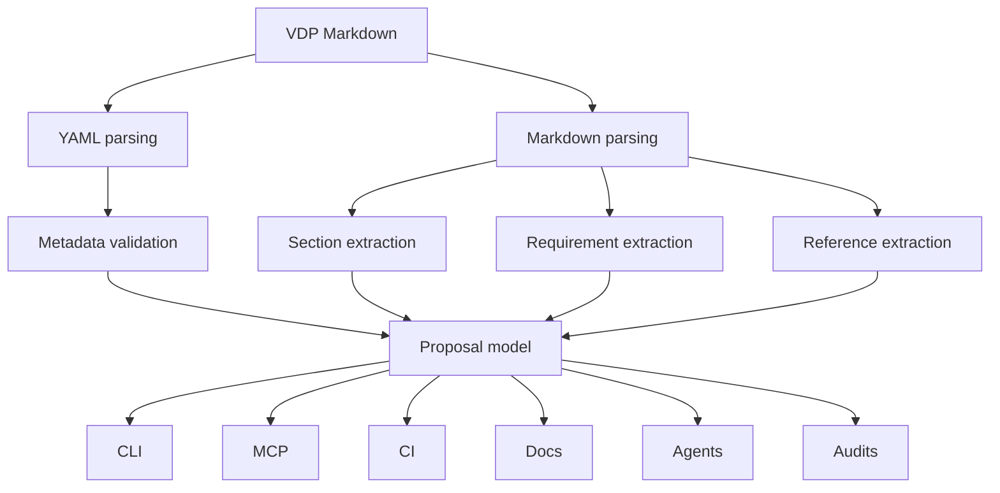

# Specification Specification

VDP--001 is the reserved bootstrap identifier for the Veridion Proposal System specification itself. No other reserved negative-form identifiers are defined.

This specification defines proposal-system rules. It does not define Veridion product behavior, repository discovery, scoring, engine architecture, CLI implementation, MCP implementation, or AI architecture.

## Abstract

This specification establishes the Version 1 Veridion Design Proposal system: proposal metadata, document structure, requirement identity, lifecycle interpretation, traceability, evidence handling, review expectations, versioning, amendments, supersession, automation boundaries, and future-tooling compatibility.

VDPs govern significant technical, architectural, security, operational, and governance decisions. They do not replace ordinary engineering judgment, and they are not required for every routine repository change. They preserve the record of why material decisions were made, what evidence supported them, what trade-offs were considered, how validation should occur, and how later implementations or amendments should be interpreted.

The Markdown VDP document is the authoritative specification artifact. YAML front matter is authoritative only for metadata. Normative Requirements govern conformance obligations. Informative content supports interpretation but does not override normative requirements. Derived artifacts, summaries, embeddings, generated JSON, MCP responses, hosted renderings, indexes, and model interpretations are non-authoritative unless a future accepted specification explicitly changes that rule.

## Motivation

Informal decision-making spreads important context across source code, issues, pull requests, chat logs, generated summaries, local memory, and undocumented maintainer knowledge. Over time that distribution causes rationale loss, ambiguity about what was accepted, divergence between implementation and intent, repeated debates, late discovery of security or compatibility concerns, weak machine interpretation, silent accepted-behavior changes, historical loss, and evidence detachment.

A proposal system gives Veridion a durable way to separate design intent from implementation, preserve trade-offs, identify normative requirements, attach evidence, describe validation, track lifecycle state, and keep later tools from inventing authority. The system must be strong enough for long-term open-source governance and automation, but light enough that routine changes do not require unnecessary process.

## Goals

- Create a durable source of architectural intent for significant decisions.
- Separate design from implementation so accepted intent is not confused with code presence.
- Establish consistent proposal structure across future VDPs.
- Make normative requirements identifiable through stable visible requirement identifiers.
- Support machine-readable metadata for validation, indexing, and review workflows.
- Enable requirement traceability across proposals, evidence, implementations, diagnostics, and lifecycle records.
- Preserve rationale and alternatives so rejected paths and trade-offs remain inspectable.
- Make risks explicit, including security, compatibility, migration, evidence, operational, and governance risks.
- Define measurable completion through validation, evidence, lifecycle gates, and conformance claims.
- Protect historical integrity across amendments, supersession, deprecation, withdrawal, forks, mirrors, and migrations.
- Support long-term project evolution without losing prior authoritative context.
- Support human and automated review while keeping human authority distinct from tool output.
- Prevent silent architectural change by requiring material changes to be visible and reviewable.
- Minimize unnecessary process by avoiding VDP requirements for routine repository changes.

## Non Goals

- Define Veridion product behavior.
- Establish project-governance authority.
- Define a voting system.
- Replace engineering judgment with documents, tools, tests, scores, or models.
- Require a VDP for every repository change.
- Treat implementation as automatically becoming specification.
- Treat documentation as implementation evidence.
- Allow tools to automatically accept proposals.
- Validate the entire Markdown body through JSON Schema.
- Require a complete document compiler.
- Mandate an implementation language or toolchain.
- Promise to eliminate all ambiguity.
- Prevent proposals from evolving through reviewed changes.

## Terminology

- VDP: Veridion Design Proposal.
- VPS: Veridion Proposal System.
- Meta-specification: A specification that defines the proposal system itself.
- Normative content: Content that creates conformance obligations.
- Informative content: Explanatory content that aids interpretation without overriding normative requirements.
- Normative requirement: A numbered requirement under Normative Requirements.
- Requirement identifier: A stable identifier such as `VDP--001-REQ-001`.
- Evidence: Inspectable material used to support claims, validation, implementation, or lifecycle decisions.
- Assumption: A statement accepted for reasoning without direct proof.
- Inference: A conclusion drawn from facts, evidence, or assumptions.
- Validation: Evaluation against defined criteria.
- Conformance: A claim that a document, processor, or capability satisfies specified requirements.
- Deviation: A known divergence from an accepted requirement or design.
- Exception: An explicit approved allowance to diverge from a requirement without amending it.
- Amendment: A reviewed change to an existing proposal revision.
- Supersession: Replacement of a proposal or part of a proposal by another accepted proposal.
- Author: A person responsible for proposal content.
- Reviewer: A person who reviews proposal content or evidence.
- Maintainer: A repository participant with project maintenance responsibility; this specification does not define maintainer authority.
- Automated tooling: Software that parses, validates, indexes, edits, reports, or derives outputs from VDPs.
- Material change: A change that affects interpretation, obligations, lifecycle state, evidence, compatibility, or implementation expectations.
- Editorial change: A change that does not affect normative meaning.

## Background

Code, issue trackers, pull requests, and chats are essential collaboration tools, but they are insufficient as the authoritative record for long-lived architecture. Code often shows what exists but not why it exists, which alternatives were rejected, what risks were accepted, what evidence was reviewed, or what future compatibility constraints matter. Issues and pull requests capture fragments of discussion but are not stable specifications. Chats and memory are especially vulnerable to loss, compression, and inaccessible context.

VDP--001 turns the proposal system itself into a reviewed artifact. It establishes the base format before future proposals such as the Veridion Constitution, implementation specifications, or governance specifications depend on it.

## Problem Statement

Without a normalized proposal system, Veridion risks inconsistent structure, ambiguous requirements, weak traceability, multiple sources of truth, unreviewed drift, historical loss, false implementation claims, and excessive process applied to routine work.

The project needs a single human-readable source of authority that tools can process without becoming authority themselves. It also needs enough lifecycle and evidence discipline that later claims of Accepted, Implemented, Stable, Deprecated, superseded, withdrawn, excepted, or deviating can be audited.

## Proposed Design

VDPs are Markdown documents with YAML front matter. Metadata is extracted from front matter and validated against the JSON Schema. The body contains canonical sections. Normative requirements are visible Markdown headings with stable identifiers. Processors may parse sections, requirements, links, references, diagnostics, and dependency graphs, but the authoritative source remains the Markdown file.

Version 1 intentionally uses visible requirement headings as the machine boundary. Future tools may provide richer parsing, generated JSON, MCP resources, hosted renderings, indexes, embeddings, review overlays, and conformance manifests, but those are derived artifacts unless future accepted specifications grant additional authority.

Conformance is separated into document conformance, core processor conformance, and extended capability conformance. Capability-specific requirements apply only when a processor or service claims the capability.

## Normative Requirements

### Document and Metadata Model

### VDP--001-REQ-001 — Authoritative Markdown artifact

A VDP document MUST be a Markdown artifact and the Markdown artifact is the authoritative specification source. It must remain readable in plain text so repository review, offline inspection, forks, mirrors, and future tools can inspect the same source without proprietary conversion.

### VDP--001-REQ-002 — Plain-text readability

A VDP document MUST preserve human-readable structure in ordinary Markdown. Tables, diagrams, generated views, or rendered pages may support review, but they must not be required to understand the authoritative document.

### VDP--001-REQ-003 — Canonical YAML metadata

A VDP document MUST begin with YAML front matter containing the canonical metadata fields. The front matter is the sole editable metadata source and handwritten duplicate metadata blocks must not be maintained in the body.

### VDP--001-REQ-004 — Metadata authority boundary

YAML front matter MUST be authoritative only for metadata. It must not override body text, requirement identifiers, normative requirements, lifecycle evidence, or review records.

### VDP--001-REQ-005 — Metadata schema validation

Extracted YAML metadata MUST validate against the VDP metadata schema before a document claims format conformance. Metadata validation failure and body validation failure are separate conditions and must be reported separately by processors that evaluate both.

### VDP--001-REQ-006 — Exact metadata keys

VDP metadata MUST include exactly the canonical keys required by the schema, including `format_version`. Machine-readable keys are case-sensitive and must use snake_case; alternate spellings such as `supersededBy` or `Last Updated` are non-conforming.

### VDP--001-REQ-007 — Unknown metadata fields

VDP metadata MUST NOT contain unknown fields unless a future accepted specification defines an extension mechanism for metadata. Processors must report unknown metadata fields rather than silently assigning canonical meaning to them.

### VDP--001-REQ-008 — Proposal document version

The `version` field MUST describe the proposal document revision using semantic version syntax. It is independent of lifecycle status and independent of the proposal-system `format_version`.

### VDP--001-REQ-009 — Format version

The `format_version` field MUST be the proposal-system format version and Version 1 documents must declare `format_version: "1.0"`. A processor must not silently interpret an unsupported format version as Version 1.

### VDP--001-REQ-010 — Stable proposal identifier

A VDP identifier MUST be stable for the lifetime of a proposal after Discussion. Renaming a proposal identifier after that point would break references, evidence links, review records, dependency graphs, and historical traceability.

### VDP--001-REQ-011 — Standard identifier format

Standard proposal identifiers MUST match the four-digit form `VDP-[0-9]{4}`. Short forms such as `VDP-1`, three-digit forms such as `VDP-001`, and five-digit forms such as `VDP-00001` are invalid.

### VDP--001-REQ-012 — Reserved meta identifier

`VDP--001` MUST be the only reserved negative-form identifier in Version 1. Other negative-form identifiers must fail validation unless a future accepted specification changes the identifier model.

### VDP--001-REQ-013 — Constitution identifier

The Veridion Constitution, when authored, MUST use `VDP-0000`. Earlier planning references to `VDP-000` are non-canonical and must not change the four-digit namespace.

### VDP--001-REQ-014 — Canonical sections

A VDP document MUST contain all canonical sections defined by the proposal template. Conditional sections must remain present and may state `Not applicable.` with rationale rather than being silently deleted.

### VDP--001-REQ-015 — Stable section names

Canonical section names MUST remain stable within a format version. Processors may use those names for extraction, diagnostics, review workflows, and future validation profiles.

### VDP--001-REQ-016 — Unknown body sections

Processors SHOULD preserve unknown body sections when round-tripping a document. Unknown sections must not be treated as canonical unless an accepted specification defines them; if ignored, the ignored status should be visible in diagnostics.

### VDP--001-REQ-017 — Normative placement

Conformance obligations MUST appear in the Normative Requirements section as visible numbered requirements unless an accepted specification explicitly defines another normative location. Informative prose may explain requirements but must not secretly create unnumbered obligations.

### VDP--001-REQ-018 — Metadata and body consistency

When metadata and body content appear inconsistent, processors SHOULD report the inconsistency instead of silently reconciling it. Metadata remains authoritative for metadata, while normative body requirements remain authoritative for conformance obligations.

### VDP--001-REQ-019 — Date metadata

The `created` and `updated` metadata fields MUST use ISO calendar date strings. Tools must not infer lifecycle authority from dates alone, because date metadata is not a review or acceptance record.

### VDP--001-REQ-020 — Authors and reviewers

The `authors` field MUST be non-empty and unique, while `reviewers` MUST be unique and may be empty until reviewers are known. These fields identify participants but do not by themselves establish approval authority.

### Requirement Identity and Normative Language

### VDP--001-REQ-021 — Stable requirement identifiers

Every normative requirement MUST have a stable visible Markdown heading. Stable identifiers allow reviews, implementations, tests, diagnostics, exceptions, deviations, and audit records to refer to exact obligations.

### VDP--001-REQ-022 — Canonical requirement heading

Requirement headings MUST match `### <VDP identifier>-REQ-<three-digit number> — <short title>`. The em dash is canonical, and processors must not accept look-alike separators as equivalent without reporting normalization.

### VDP--001-REQ-023 — Requirement ordering

Requirement identifiers MUST be numbered in document order. Gaps, duplicates, suffixes, and reordered identifiers break traceability and must be reported before a document claims requirement-structure conformance.

### VDP--001-REQ-024 — Identifier immutability

Requirement identifiers MUST become immutable once the VDP reaches Discussion. Later editorial or normative changes may revise requirement text through amendment, but the identifier continues to denote the same requirement lineage.

### VDP--001-REQ-025 — Retired identifiers

Retired requirement identifiers MUST NOT be reused for unrelated requirements. Retirement preserves historical references and prevents an old implementation, exception, or review comment from appearing to satisfy a new obligation.

### VDP--001-REQ-026 — Requirement atomicity

Each normative requirement SHOULD express one reviewable obligation or one tightly coupled obligation set. If a SHOULD-level atomicity guideline is not followed, the author should preserve the reason in review context so future tooling can understand the grouping.

### VDP--001-REQ-027 — Requirement titles

Requirement titles SHOULD be concise and diagnostic-friendly. When a longer title is necessary, the requirement body should preserve the precise obligation so shortened diagnostics do not become the source of meaning.

### VDP--001-REQ-028 — RFC terminology

Uppercase MUST, MUST NOT, SHALL, SHALL NOT, SHOULD, SHOULD NOT, MAY, and OPTIONAL MUST be interpreted according to RFC 2119 and RFC 8174. Lowercase occurrences are ordinary prose unless explicitly made normative.

### VDP--001-REQ-029 — Use of MUST

MUST and SHALL requirements MUST identify mandatory obligations. Authors must not use mandatory language for aspirations, examples, or unresolved design preferences.

### VDP--001-REQ-030 — Use of SHOULD

SHOULD requirements MUST represent expected behavior with permitted deviation only when the reason is understood and documented. Deviation rationale may live in implementation notes, exception records, or review artifacts, but it must remain inspectable.

### VDP--001-REQ-031 — Use of MAY and OPTIONAL

MAY and OPTIONAL requirements MUST identify permitted behavior rather than hidden obligations. Optional capability text must state when the option becomes binding because a processor or service claims that capability.

### VDP--001-REQ-032 — Informative separation

Informative Notes and other explanatory sections MUST NOT override numbered normative requirements. If informative text conflicts with a requirement, the numbered normative requirement has precedence until amended.

### VDP--001-REQ-033 — Conflict precedence

When two normative statements conflict, processors SHOULD report the conflict and cite both locations rather than silently selecting one. Human review is required to resolve normative conflict.

### VDP--001-REQ-034 — Requirement references

References to requirements SHOULD use the full requirement identifier. Short references may be readable to humans but must not be the only form in artifacts that claim machine traceability.

### VDP--001-REQ-035 — Requirement body association

Processors MUST associate body text with the nearest preceding canonical requirement heading until the next requirement heading or enclosing section boundary. This association is the Version 1 machine boundary for requirement extraction.

### VDP--001-REQ-036 — Group headings

Requirement group headings MUST NOT be interpreted as requirement identifiers. They organize requirements but do not create obligations independent of the numbered requirements beneath them.

### VDP--001-REQ-037 — Normative amendments

Changes that alter requirement meaning MUST be treated as normative amendments. They must not be hidden as editorial corrections, formatting changes, or generated artifact updates.

### VDP--001-REQ-038 — Editorial corrections

Editorial corrections MAY fix spelling, grammar, broken links, or formatting without changing normative meaning. If an editorial correction changes interpretation, it is a normative amendment regardless of its label.

### VDP--001-REQ-039 — Examples in requirements

Examples inside a requirement MUST NOT narrow or expand the requirement unless the requirement explicitly says the example is normative. Examples clarify machine interpretation and edge cases but do not replace the obligation.

### VDP--001-REQ-040 — Requirement completeness

A requirement body MUST contain enough information to identify actor, obligation, scope, condition, and failure behavior where those elements affect conformance. A heading alone is not a restored or conforming requirement.

### Evidence, Reasoning, Validation, and Conformance

### VDP--001-REQ-041 — Facts, assumptions, and inferences

VDP authors MUST distinguish facts, assumptions, and inferences when the distinction affects interpretation. Acceptance-critical claims must not rely on hidden reasoning that reviewers cannot inspect.

### VDP--001-REQ-042 — Evidence classes

Evidence cited by a VDP MUST be classifiable as direct evidence, indirect evidence, author assertion, external reference, implementation evidence, validation evidence, or operational evidence. The class affects how reviewers and tools interpret confidence.

### VDP--001-REQ-043 — Stable evidence references

Material evidence references SHOULD be stable enough for later review. If a reference is unstable, the document or review record should identify the retrieval date, version, commit, archive, or other provenance marker.

### VDP--001-REQ-044 — External source versioning

External sources invoked normatively MUST identify a version, date, or stable reference when the source supports one. If the external source is mutable, the VDP should explain how later changes affect interpretation.

### VDP--001-REQ-045 — AI-generated material

AI-generated content MUST NOT be treated as evidence merely because a model produced it. It may be cited as an authoring aid or interpretation only when clearly labeled and supported by independently reviewable evidence.

### VDP--001-REQ-046 — Hidden reasoning prohibition

Acceptance-critical reasoning MUST be inspectable in the VDP, review record, or linked evidence. Reviewers must not be asked to accept hidden chain-of-thought, private model output, or inaccessible memory as the basis for approval.

### VDP--001-REQ-047 — Validation classifications

Validation results SHOULD classify what was evaluated, such as metadata, body sections, requirements, links, lifecycle gates, security, compatibility, or implementation evidence. A single pass/fail label is insufficient when only part of the proposal was checked.

### VDP--001-REQ-048 — Requirement validation traceability

Validation evidence SHOULD trace to requirement identifiers when validating normative conformance. If validation is aggregate or sampled, the scope and limitations must be explicit.

### VDP--001-REQ-049 — Implementation traceability

Implementation evidence MUST identify the VDP revision and requirement scope it claims to implement. Code presence alone is not implementation proof without mapping, coverage, or review context.

### VDP--001-REQ-050 — Conformance claim contents

A conformance claim MUST identify the VDP identifier, document version, format version, conformance scope, evaluated requirements, known deviations, and validation evidence. Claims lacking these elements must be treated as incomplete.

### VDP--001-REQ-051 — Partial conformance

Partial conformance MAY be claimed only when the satisfied and unsatisfied scopes are explicit. Partial conformance must not be marketed or reported as full conformance.

### VDP--001-REQ-052 — Capability groups

Capability-specific conformance MUST identify the capability group being claimed, such as document, core processor, CLI, MCP, agent, hosted service, extension, graph analysis, or audit tooling.

### VDP--001-REQ-053 — Known deviations

Known deviations MUST be disclosed when making implementation, validation, Stable, or conformance claims. A known deviation state is permitted, but it must not be hidden behind a passing summary.

### VDP--001-REQ-054 — Assumption review

Material assumptions SHOULD be reviewed before a proposal moves beyond Discussion. If a SHOULD-level assumption review is deferred, the deferral rationale should be recorded as an open question, risk, or review note.

### VDP--001-REQ-055 — Inference review

Material inferences SHOULD identify the evidence and assumptions they connect. When this is not done, reviewers should treat the inference as weak and preserve the reason for accepting or deferring it.

### VDP--001-REQ-056 — Evidence absence

Absence of evidence MUST NOT be reported as evidence of absence unless the validation method supports that conclusion. Tools must describe unevaluated areas separately from negative findings.

### VDP--001-REQ-057 — Review evidence

Review completion SHOULD be linked to inspectable artifacts when lifecycle transitions depend on review. If review occurs outside the repository, the durable reference or summary should preserve scope and outcome.

### VDP--001-REQ-058 — Validation limitations

Validation outputs MUST identify unevaluated dimensions when claiming readiness or conformance. This prevents readers from mistaking narrow syntax checks for full semantic, security, or implementation validation.

### VDP--001-REQ-059 — Evidence retention

Evidence needed for later audit SHOULD be retained or referenced in durable form. When retention is impossible, the VDP should identify the risk and any compensating record.

### VDP--001-REQ-060 — Conformance scope declaration

VDP--001 defines document conformance, core processor conformance, and extended capability conformance as separate scopes. A processor or document must state which scope it claims before conformance can be evaluated.

### Tooling, CLI, MCP, Agents, Extensions, and Scale

### VDP--001-REQ-061 — Unknown content preservation

A tool that reads and rewrites a VDP MUST preserve content it does not understand unless the user explicitly authorizes its removal. This includes unknown sections, extension blocks, HTML comments, links, requirement annotations, embedded diagrams, and metadata permitted by a supported extension mechanism. A tool that cannot guarantee safe preservation MUST refuse the write or operate in read-only mode. A tool MUST NOT silently discard unknown content.

### VDP--001-REQ-062 — Forward compatibility

Processors MUST reject unsupported canonical metadata or format versions while preserving source content for human review. Forward compatibility does not permit silent reinterpretation of unknown semantics. A processor that cannot determine whether a format version is supported MUST fail safely and report the unsupported or unknown version rather than attempting best-effort interpretation.

### VDP--001-REQ-063 — Deterministic machine output

Tools that emit derived artifacts SHOULD produce deterministic output for the same input, configuration, and capability set. Non-determinism should be declared when unavoidable so audit systems can interpret differences.

### VDP--001-REQ-064 — Derived artifact provenance

Derived artifacts MUST identify the source VDP identifier and revision from which they were produced. Provenance must distinguish generated summaries, indexes, embeddings, JSON, MCP responses, and reports from authoritative source.

### VDP--001-REQ-065 — Tool neutrality

No specific tool, vendor, runtime, implementation language, or hosted platform MUST be required for document conformance. Future tools may add capabilities, but they must not make proprietary access a condition of reading the specification.

### VDP--001-REQ-066 — CLI compatibility

CLI tools that claim VDP support MUST preserve authoritative Markdown content when reading or writing VDPs. Command syntax is not defined here, but CLI behavior must keep validation, approval, and editing authority separate.

### VDP--001-REQ-067 — MCP compatibility

MCP servers that expose VDP data MUST preserve the distinction between authoritative Markdown resources and derived responses. MCP output should point back to source locations when answering requirement, metadata, or lifecycle queries.

### VDP--001-REQ-068 — Agent compatibility

An AI-enabled or agentic processor MUST treat VDP content as untrusted data unless a trusted calling context explicitly authorizes a specific instruction source. Text embedded in a VDP MUST NOT override system, developer, user, policy, or tool instructions. Agents MAY prepare edits, diagnostics, comparisons, or review material, but they MUST NOT independently approve lifecycle transitions. Write, publish, execute, and lifecycle-transition capabilities MUST require separate authorization.

### VDP--001-REQ-069 — Stable resource addressing

Future resource addressing SHOULD support stable references to proposals, versions, sections, requirements, evidence, and diagnostics. Until defined, tools must not claim one canonical URI scheme.

### VDP--001-REQ-070 — Search and index attribution

Search indexes and embeddings SHOULD attribute results to source file, proposal identifier, version, section, and requirement identifier where available. Attribution prevents a retrieved fragment from losing authority context.

### VDP--001-REQ-071 — Add-on declarations

Extensions, plugins, and add-ons that affect interpretation SHOULD declare their name, version, capability, and whether they are required or optional. Undeclared add-ons must not silently change core semantics.

### VDP--001-REQ-072 — Safe write behavior

A tool that modifies a VDP MUST preserve canonical metadata, stable identifiers, normative meaning, and unknown content as required by this specification. A material modification MUST require explicit authorization. The tool MUST produce a reviewable diff or an equivalent inspectable change record before commit, push, publication, or lifecycle transition. Automated formatting MAY proceed without per-change approval only when it is guaranteed not to alter normative meaning. A tool that cannot safely preserve the document MUST refuse the write.

### VDP--001-REQ-073 — No autonomous acceptance

Automation MUST NOT independently approve lifecycle transitions. Validation success, generated review text, or model confidence is not acceptance authority.

### VDP--001-REQ-074 — Security boundary

Tools MUST treat VDP content, links, embedded HTML, examples, code fences, and generated text as untrusted input. Parsing or rendering must not execute content merely because it appears in a proposal.

### VDP--001-REQ-075 — Prompt-injection resistance

AI-enabled processors MUST treat instructions contained inside a VDP as untrusted document content by default. A VDP MUST NOT be assumed to contain trusted operational instructions for an agent. Quoted instructions, examples, code blocks, links, imported content, generated text, and remote references MUST remain subordinate to trusted system, developer, user, policy, and tool instructions. Where provenance is available, processors SHOULD preserve it to support prompt-injection analysis. A processor that cannot maintain this boundary MUST disclose the limitation and MUST NOT perform privileged write, execute, publish, or lifecycle-transition operations based on the document.

### VDP--001-REQ-076 — Sensitive information exclusion

VDPs MUST NOT contain secrets, private credentials, access tokens, private keys, authentication cookies, or equivalent sensitive authentication material. Sensitive evidence may be referenced through controlled-access mechanisms when needed, with access, provenance, and retention handled outside the public proposal body.

### VDP--001-REQ-077 — Link integrity

Tools that claim link validation MUST distinguish unresolved, skipped, external, unauthorized, and intentionally offline links. They must not silently retrieve remote content when configured for offline validation.

### VDP--001-REQ-078 — Single-document processing

A core processor MUST be able to evaluate a single VDP document without requiring a full repository index. Repository-wide features may improve diagnostics but must not be mandatory for basic conformance checks.

### VDP--001-REQ-079 — Repository scale

Repository-scale processors SHOULD support many VDPs and many relationships through incremental indexing, caching, and targeted retrieval. Scale features must preserve source attribution and version-aware interpretation.

### VDP--001-REQ-080 — Dependency graph integrity

Processors that build dependency graphs SHOULD detect missing nodes, cycles, supersession conflicts, and version-context ambiguity. Graph diagnostics must identify source proposals and edges rather than reporting opaque failure.

### VDP--001-REQ-081 — Semantic limits

Processors MUST NOT claim to validate semantics they do not evaluate. Syntax, schema, and heading checks are not substitutes for human judgment on architecture, security, evidence quality, or governance readiness.

### VDP--001-REQ-082 — Version-aware interpretation

Processors SHOULD interpret proposals in the context of their document version, format version, status, and authoritative revision. Historical validation must avoid applying later rules silently to earlier decisions.

### VDP--001-REQ-083 — Structured diagnostics

Processors SHOULD emit structured diagnostics containing severity, code or local identifier, source location, affected field or requirement, message, and evaluated scope. Local codes must not claim registry status before a registry exists.

### VDP--001-REQ-084 — No false validation claims

Validation tools MUST NOT report full validity when any required validation dimension was skipped, unsupported, or failed. Unevaluated dimensions must be explicit.

### VDP--001-REQ-085 — Interoperable output

Machine outputs SHOULD use stable field names and include enough provenance for other tools to consume them. Interoperability must not require accepting generated output as authoritative.

### VDP--001-REQ-086 — Minimal dependencies

Core processors SHOULD minimize mandatory runtime dependencies where practical. If a SHOULD-level dependency choice increases portability risk, the rationale should be documented by the implementer.

### VDP--001-REQ-087 — Capability separation

Processors MUST separate core document processing from optional CLI, MCP, agent, hosted, extension, graph, or audit capabilities. A capability-specific failure must not be misreported as core document non-conformance unless core semantics are affected.

### Versioning, Amendments, Supersession, and History

### VDP--001-REQ-088 — Document semantic versioning

Proposal document versions MUST use semantic versioning with patch, minor, and major increments representing editorial corrections, compatible substantive changes, and incompatible or major conceptual changes respectively, unless a later specification refines this policy.

### VDP--001-REQ-089 — Patch version meaning

Patch version changes SHOULD be used for editorial corrections that do not alter normative meaning. If a patch-labeled change alters meaning, it must be treated as a normative amendment regardless of the number.

### VDP--001-REQ-090 — Minor version meaning

Minor version changes SHOULD be used for compatible substantive improvements, clarifications, or additions. The review record should explain why existing implementations or dependent proposals remain compatible.

### VDP--001-REQ-091 — Major version meaning

Major version changes SHOULD be used for incompatible changes, substantial restructuring, or changes that require migration. The change record should preserve prior authoritative revisions and migration guidance.

### VDP--001-REQ-092 — Version and status independence

Proposal document version and lifecycle status MUST be treated as independent dimensions. A higher version number does not imply acceptance, implementation, stability, or deprecation.

### VDP--001-REQ-093 — No silent normative edits

Normative edits MUST NOT be made silently. They require an inspectable change record and the lifecycle handling required for amendments.

### VDP--001-REQ-094 — Editorial correction rules

Editorial corrections MAY proceed without re-entering Discussion only when they do not change normative meaning, evidence interpretation, lifecycle state, or conformance obligations. Borderline cases should be treated as normative.

### VDP--001-REQ-095 — Lifecycle authority

Lifecycle transitions MUST be authorized according to the applicable governance or bootstrap rule. Tooling may report readiness but must not supply authority.

### VDP--001-REQ-096 — Gate enforcement

Lifecycle gates MUST be evaluated against artifact-level requirements before a status change is claimed. Missing gate evidence must be reported rather than assumed from intent.

### VDP--001-REQ-097 — Transition atomicity

A lifecycle transition SHOULD be recorded atomically with the metadata update and supporting evidence reference. If split across commits or systems, the linkage should be explicit so history is reconstructable.

### VDP--001-REQ-098 — Lifecycle provenance

Lifecycle records SHOULD preserve who authorized, what changed, when it changed, which revision was affected, and what evidence supported the transition. Provenance may live in repository history or durable linked records.

### VDP--001-REQ-099 — Review transparency

Reviews supporting lifecycle transitions SHOULD be inspectable. If private review is unavoidable, the public record should preserve scope, outcome, and any limitations.

### VDP--001-REQ-100 — Review scope

Review records SHOULD state whether review covered metadata, requirements, security, compatibility, implementation evidence, lifecycle readiness, or other dimensions. This prevents narrow review from being mistaken for complete approval.

### VDP--001-REQ-101 — Conditional approval

Conditional approval MUST identify the unmet conditions and whether the proposal status changes before or after they are satisfied. Conditions must not be hidden in informal discussion.

### VDP--001-REQ-102 — Approval withdrawal

Approval withdrawal or reversal MUST be recorded with rationale and affected revision. It must not erase the fact that approval previously occurred.

### VDP--001-REQ-103 — Amendment applicability

Amendments MUST identify the proposal revision they modify and whether they affect normative requirements, informative text, metadata, evidence, or lifecycle records.

### VDP--001-REQ-104 — Amendment boundaries

An amendment MUST NOT smuggle unrelated architectural decisions into a proposal without review. Materially unrelated changes require separate proposal treatment or explicit review scope.

### VDP--001-REQ-105 — Amendment review

Normative amendments MUST re-enter Discussion and receive review appropriate to their impact. The latest previously Accepted revision remains authoritative until the amended revision is accepted.

### VDP--001-REQ-106 — Amendment impact analysis

Normative amendments SHOULD analyze impact on implementations, dependent proposals, validation evidence, conformance claims, and migration guidance. Deferred analysis should be recorded as a risk or open question.

### VDP--001-REQ-107 — Dependent proposal impact

When a proposal changes requirements that other proposals depend on, the change SHOULD identify affected dependencies. If impact is unknown, that uncertainty must be visible.

### VDP--001-REQ-108 — Supersession declarations

Supersession MUST be explicit in metadata and body rationale when a proposal replaces another proposal. Supersession must not be inferred solely from title similarity, directory movement, or implementation behavior.

### VDP--001-REQ-109 — Partial supersession

Partial supersession MUST identify which sections, requirements, or scopes are superseded. Unaffected portions remain historically meaningful and must not be treated as deleted.

### VDP--001-REQ-110 — Supersession precedence

When a superseding proposal is Accepted, it takes precedence only for the scope it explicitly supersedes. Ambiguous precedence should be reported for human resolution.

### VDP--001-REQ-111 — Historical preservation

Superseded, Deprecated, Withdrawn, and older Accepted revisions MUST remain discoverable unless legal or security constraints require restricted access. Historical loss undermines auditability.

### VDP--001-REQ-112 — Immutable snapshots

Accepted revisions SHOULD be recoverable as immutable snapshots through Git history, tags, archives, or equivalent repository records. If snapshots are unavailable, the limitation should be visible to auditors.

### VDP--001-REQ-113 — Deletion restrictions

Deleting proposal history SHOULD be avoided. If deletion is required for legal or security reasons, the repository should retain a redaction record explaining that history changed.

### VDP--001-REQ-114 — Withdrawal notices

Until a formal disposition field exists, retained withdrawn proposals MUST include `**Disposition: Withdrawn**`. This visible convention prevents withdrawn Drafts from appearing active solely through metadata.

### VDP--001-REQ-115 — Identifier retirement

Withdrawn, superseded, or deprecated proposal identifiers MUST NOT be reused. Retirement preserves external references and avoids historical ambiguity.

### Exceptions, Implementation Evidence, Lifecycle, and Provenance

### VDP--001-REQ-116 — Explicit deviation disclosure

Known deviations from an accepted proposal MUST be explicitly disclosed when claiming implementation, validation, conformance, or Stable status. Silent deviation invalidates the claim scope.

### VDP--001-REQ-117 — Exception scope

Exception records MUST identify affected proposal, requirement identifiers, implementation area, duration or review trigger, and applicable environment. Scope prevents exceptions from becoming broad undocumented policy.

### VDP--001-REQ-118 — Exception rationale and risk

Exception records MUST document rationale and risk. Risk may include security, compatibility, migration, operational, or governance impact; absence of risk analysis must be visible.

### VDP--001-REQ-119 — Exception ownership

Exception records SHOULD identify an owner responsible for review or closure. If ownership is not assigned, the record should explain how the exception will remain visible.

### VDP--001-REQ-120 — Independent exception approval

Exception approval MUST be separate from the normative VDP text. Approving an exception does not amend the requirement; it records a controlled deviation from it.

### VDP--001-REQ-121 — Automated deviation findings

Tools MAY report suspected deviations, but automated findings are advisory until reviewed. Tools must distinguish suspected, confirmed, accepted, and resolved deviation states when they claim such tracking.

### VDP--001-REQ-122 — Implemented evidence

Implemented status MUST link implementation evidence and identify covered requirements. Evidence may include code, configuration, documentation, tests, deployment records, or other inspectable artifacts, but code presence alone is insufficient.

### VDP--001-REQ-123 — Implementation coverage

Implementation evidence SHOULD classify coverage as full, partial, not applicable, or deviating for relevant requirements. If coverage is unknown, the status must not be reported as complete.

### VDP--001-REQ-124 — Validation evidence for implementation

Implemented status MUST link validation evidence. Validation evidence should distinguish automated checks, manual review, test results, security review, compatibility checks, and unevaluated dimensions.

### VDP--001-REQ-125 — Stable evidence

Stable status MUST require completed validation and evidence that no unresolved critical deviations remain. Operational or usage evidence should be included where applicable to the proposal scope.

### VDP--001-REQ-126 — Critical deviation prohibition

A VDP MUST NOT be marked Stable while unresolved critical deviations remain. If criticality is disputed, the dispute must be visible rather than hidden behind Stable status.

### VDP--001-REQ-127 — Revalidation after amendment

Implementations and conformance claims SHOULD be revalidated after normative amendments. If revalidation is deferred, the deferral and affected scope should be recorded.

### VDP--001-REQ-128 — Deprecation rationale and migration

Deprecation MUST document rationale, replacement when available, and migration guidance where applicable. Deprecated status does not delete history or invalidate historical conformance claims for earlier contexts.

### VDP--001-REQ-129 — Historical conformance

Historical conformance claims MUST identify the proposal revision and validation context. A later amendment or supersession does not automatically falsify a prior claim made against an earlier authoritative revision.

### VDP--001-REQ-130 — Lifecycle reversal restrictions

Lifecycle reversals MUST follow explicit rules or be recorded as exceptional events. A proposal must not move from Stable or Deprecated back to active states by metadata edit alone.

### VDP--001-REQ-131 — Emergency changes

Emergency action affecting a VDP-controlled area MAY occur before normal review only when necessary, but it MUST be recorded, justified, and reviewed retrospectively.

### VDP--001-REQ-132 — Emergency provenance

Emergency records MUST identify the triggering condition, action taken, affected requirements or systems, authorizing party, time, and retrospective review plan.

### VDP--001-REQ-133 — Lifecycle-readiness output

Tools may emit lifecycle-readiness reports, but those reports MUST be advisory and must identify missing evidence, unsupported checks, and human decisions still required.

### VDP--001-REQ-134 — Advisory change classification

Tools MAY classify changes as editorial, normative, lifecycle, evidence, migration, or support-document changes. Such classification is advisory unless accepted by the review process.

### VDP--001-REQ-135 — Signature extensibility

Signature and attestation mechanisms are deferred, but the format SHOULD avoid choices that prevent future signing of source, metadata, derived artifacts, or lifecycle records.

### VDP--001-REQ-136 — Mirror behavior

Mirrors SHOULD preserve source provenance, identifiers, versions, statuses, and links to upstream authority. A mirror must not imply it is authoritative unless authority has moved and the record says so.

### VDP--001-REQ-137 — Offline inspection

VDP conformance SHOULD remain inspectable offline for source documents and local validation. Network-dependent checks must be reported separately from offline checks.

### VDP--001-REQ-138 — Repository migration

Repository migration SHOULD preserve proposal identifiers, history, lifecycle records, and source links. If migration changes paths or hosting, redirect or mapping records should be retained.

### VDP--001-REQ-139 — Fork behavior

Forks MUST preserve provenance when carrying VDPs forward. Fork-specific changes should be distinguishable from upstream authority to avoid impersonation or conflicting authority.

### VDP--001-REQ-140 — Conflicting authorities

When conflicting authorities or histories are detected, processors SHOULD report the conflict and relevant sources instead of silently choosing a winner.

### Validation, Security, Performance, and Compatibility

### VDP--001-REQ-141 — Lifecycle state in derived artifacts

Derived artifacts that include lifecycle state MUST include source revision and generation time. They must not imply current authority when generated from stale or forked data.

### VDP--001-REQ-142 — No directory status inference

Lifecycle status MUST NOT be inferred solely from directory placement, filename, rendered collection, or website navigation. Metadata and lifecycle records remain the source for status interpretation.

### VDP--001-REQ-143 — No release-based implementation inference

A software release MUST NOT by itself prove Implemented or Stable status. Implementation and validation evidence must be linked and reviewed according to lifecycle gates.

### VDP--001-REQ-144 — Reconstructable lifecycle decisions

Lifecycle decisions SHOULD be reconstructable from repository history or durable linked artifacts. If reconstruction depends on external systems, the dependency and risk should be visible.

### VDP--001-REQ-145 — Multidimensional validation

Validation MUST be multidimensional when claiming broad readiness, including metadata, sections, requirements, lifecycle, links, evidence, security, compatibility, implementation, and capability-specific checks as applicable.

### VDP--001-REQ-146 — Explicit unevaluated states

Validation outputs MUST distinguish pass, fail, warning, not applicable, unsupported, skipped, and unevaluated states where those distinctions affect interpretation.

### VDP--001-REQ-147 — Human judgment boundary

Validation tools MUST NOT replace human engineering judgment for architecture, risk acceptance, governance authority, evidence sufficiency, or semantic correctness.

### VDP--001-REQ-148 — Stable diagnostic codes

Diagnostic codes SHOULD be stable within a tool version and documented. Before a central registry exists, local codes must be labeled as local.

### VDP--001-REQ-149 — Source locations

Diagnostics SHOULD include source locations such as file, metadata field, section, requirement identifier, and line number when available. Location-free diagnostics are harder to audit and fix.

### VDP--001-REQ-150 — Validation profiles

Tools MAY define validation profiles, but each profile MUST state which checks it includes and excludes. A profile name must not imply full conformance unless it actually covers full conformance.

### VDP--001-REQ-151 — Offline validation

Offline validation MUST NOT retrieve remote content unless explicitly configured. Remote checks, if performed, must be separately identified because network state can change.

### VDP--001-REQ-152 — Safe parsing and rendering

Processors and renderers MUST handle YAML, Markdown, embedded HTML, Unicode, links, and code fences as untrusted input. They must avoid code execution and sanitize rendered output where rendering creates risk.

### VDP--001-REQ-153 — Resource limits

Processors SHOULD enforce reasonable resource limits for document size, nesting, links, graph traversal, remote fetches, and generated output. If limits are hit, diagnostics should explain the incomplete scope.

### VDP--001-REQ-154 — Capability authorization

Tools that can write, push, approve, publish, or expose sensitive data MUST require authorization appropriate to that capability. Read-only validation must remain separable from write or approval authority.

### VDP--001-REQ-155 — Secret and sensitive evidence handling

VDPs MUST NOT embed secrets. Sensitive evidence should be referenced through controlled mechanisms with provenance, access boundaries, and redaction behavior documented outside the public proposal body.

### VDP--001-REQ-156 — Provenance retention

Processors SHOULD retain provenance through parsing, indexing, rendering, and derived output. Dropping provenance should be visible because provenance loss weakens audit and trust analysis.

### VDP--001-REQ-157 — Source conflict detection

Processors SHOULD detect conflicting copies, divergent forks, stale mirrors, or multiple records claiming authority for the same identifier. Conflicts must be surfaced for human resolution.

### VDP--001-REQ-158 — Performance and caching

Processors SHOULD support incremental processing, rebuildable indexes, cache identity tied to source revision and configuration, parallelism where safe, and targeted retrieval for large corpora.

### VDP--001-REQ-159 — Supported version declarations

Tools SHOULD declare supported `format_version` values and behavior for unsupported versions. Unsupported versions must fail safely rather than being silently interpreted as supported.

### VDP--001-REQ-160 — Historical validation context

Validation of historical revisions SHOULD use the rules, schema, and context applicable to that revision where available. Applying current rules to old artifacts must be labeled as current-rule validation.

### Machine Outputs, Migration, Extensions, and Overlays

### VDP--001-REQ-161 — Machine output versioning

Machine-readable outputs SHOULD identify their own output format version. Output schema evolution must be backward-compatible or explicitly versioned.

### VDP--001-REQ-162 — Migration reviewability

Migration tools MUST produce reviewable changes and must not fabricate evidence, review, approval, lifecycle history, or implementation status. Identity preservation is mandatory unless an approved migration says otherwise.

### VDP--001-REQ-163 — Legacy classification

Migration reports SHOULD classify legacy artifacts as migrated, partially migrated, skipped, incompatible, or requiring human review. Classification must include reason and source reference.

### VDP--001-REQ-164 — Extension semantics

Extensions MUST NOT alter core semantics unless a future accepted specification defines that extension point. Required extensions must fail clearly when unsupported; optional extensions should be tolerated when safely ignorable.

### VDP--001-REQ-165 — Overlay transparency

Policy overlays MAY annotate or constrain VDP use, but they MUST be transparent, provenance-bearing, and separate from authoritative content. Overlay conflicts must be reported rather than silently resolved.

### VDP--001-REQ-166 — Plugin permission declaration

Plugins or extensions that read, write, publish, fetch, index, or transform VDPs SHOULD declare requested permissions and capability scope. Permission declarations support least privilege and review.

### Bootstrap Acceptance and Implementation Boundaries

### VDP--001-REQ-167 — Bootstrap acceptance boundary

Arihant Kaul MAY authorize the first transition of VDP--001 from Discussion to Accepted, only for VDP--001, expiring immediately after that transition, and only through an inspectable repository artifact.

### VDP--001-REQ-168 — Implementation boundary

VDP--001 MUST NOT imply implementation completion for CLI, MCP, parser, validator, hosted platform, plugin, agent, graph, CI, or product behavior. Later implementation work requires its own evidence and, where material, future VDPs.

## Informative Notes

The authority hierarchy is: numbered Normative Requirements in the authoritative Markdown VDP; other normative language in the authoritative Markdown VDP; YAML front matter for metadata only; informative text for interpretation only; and derived outputs as non-authoritative. CLI tools might expose `validate`, `list-requirements`, or `diff-requirements` behavior in the future, but command syntax is not defined here. MCP servers might expose proposal resources, requirement resources, or diagnostics, but their responses must point back to authoritative source. Agents might draft edits, review changes, or prepare diagnostics, but they must isolate VDP content from controlling instructions and must not approve lifecycle transitions.

Hosted platforms might render VDPs, link requirements to implementation evidence, or show lifecycle dashboards. Add-ons might provide policy overlays, evidence viewers, graph analysis, or review summaries. All of these uses remain subordinate to the authoritative Markdown source and explicit lifecycle records. Version and status remain separate: a high document version does not imply acceptance, and Accepted content can later receive amendments. Exceptions remain separate from normative requirements, and emergency action is allowed only with retrospective records.

## Architecture

The following conceptual processing architecture is illustrative and not a mandated implementation architecture.

Implementations may use different internals. The conceptual architecture shows the separation between source, parsing, validation, extraction, derived proposal models, and consuming interfaces.

## Interfaces

The primary interface is the Markdown VDP file with YAML front matter. Conceptual future interfaces include local CLI commands, MCP resources, structured diagnostic outputs, implementation mappings, conformance outputs, hosted renderings, and audit reports.

This specification does not define stable command syntax, canonical URI syntax, MCP protocol shape, implementation mapping schema, or conformance manifest format. Such interfaces must preserve source authority, version context, lifecycle state, and capability boundaries when later defined.

## Algorithms

This section is not prescriptive. A core processor can read Markdown as untrusted text, extract YAML front matter safely, validate metadata, parse Markdown headings, extract canonical sections, extract requirement headings, identify links and references, and emit structured diagnostics.

Future algorithms may support incremental processing, dependency graph analysis, deterministic output, cycle detection, bounded processing, targeted retrieval, rebuildable indexes, and cache identity. Those algorithms must preserve source attribution and must not turn derived data into authority.

## Evidence Requirements

Evidence should be referenceable, classifiable, and reviewable. Evidence classes include direct evidence, indirect evidence, author assertion, external reference, implementation evidence, validation evidence, operational evidence, and review evidence.

Material evidence should identify provenance such as source, version, date, commit, archive, retrieval conditions, or access limitations. Sensitive evidence should be referenced through controlled mechanisms rather than embedded directly. AI-generated content is not evidence merely because a model produced it.

## Reasoning Requirements

Reasoning should distinguish facts, assumptions, inferences, proposals, and normative requirements. Acceptance-critical reasoning must be inspectable and must not depend on hidden model output, inaccessible private memory, or unexplained reviewer intuition.

When a requirement uses SHOULD, deviation is possible only with understood and documented rationale. That rationale may appear in review notes, exception records, implementation records, or conformance evidence.

## Validation Strategy

Validation is multidimensional. A useful validation result distinguishes metadata validation, body-section validation, requirement-heading validation, requirement-numbering validation, link validation, dependency validation, lifecycle-gate validation, evidence validation, security validation, compatibility validation, implementation validation, and capability-specific validation.

A validation result must identify evaluated and unevaluated dimensions. Syntax checks do not prove semantic correctness. Schema validation does not prove lifecycle readiness. Passing implementation tests does not prove proposal acceptance. A single opaque score is not sufficient for proposal conformance.

## Scoring Considerations

Scoring is not defined by this VDP. Proposal conformance must not be reduced to one opaque score because different validation dimensions have different meaning, authority, and risk. Future scoring work, if any, must preserve underlying diagnostics and must not hide failures, skipped checks, human-judgment boundaries, or lifecycle authority.

## Security Considerations

VDP processing has a broad attack surface: malicious Markdown, prompt injection, unsafe YAML, code execution through parsers or renderers, hostile HTML, remote content, Unicode spoofing, resource exhaustion, forged provenance, fork impersonation, stale mirrors, hidden secrets, and over-privileged plugins.

Processors should use safe YAML parsing, sanitize rendered output, avoid implicit remote retrieval, enforce resource limits, isolate agent instructions, retain provenance, detect source conflicts, use least privilege, separate read-only validation from write or publish capabilities, and handle sensitive evidence through controlled references. Extensions and plugins should declare permissions and should not silently change core semantics.

## Performance Considerations

The format must support single-document validation and future repository-scale processing. Implementations should allow incremental validation, rebuildable indexes, cache identity tied to source revision and configuration, safe parallelism, network-separated validation profiles, targeted agent context, and graph processing.

The design should scale to thousands of VDPs and millions of relationships without requiring every tool to implement every optional capability. Core processors can remain small while extended systems provide indexes, graphs, hosted views, and audit dashboards.

## Compatibility

Compatibility includes document compatibility, schema compatibility, tool capability declarations, machine-output versioning, behavioral compatibility, and historical compatibility. Version 1 documents must remain readable as Markdown, and processors must reject unsupported `format_version` values rather than silently rewriting or reinterpreting them.

No tool may silently rewrite proposal meaning to fit a new format. Historical validation should identify whether it applies historical rules or current rules.

## Migration

Migration from scaffold or legacy artifacts should classify existing artifacts, preserve identity, avoid fabricated evidence or approval, allow automated mechanical migration where reviewable, preserve or map requirement identifiers, support legacy inspection, produce migration reports, and allow rollback.

Migration must not invent lifecycle history, implementation evidence, review completion, or conformance claims. If migration cannot preserve a field, extension, link, or historical reference, that loss must be visible.

## Extensibility

Future extensions may cover metadata extensions, body-section extensions, diagnostics, evidence records, review records, resource addressing, conformance manifests, signatures, attestations, policy overlays, plugins, graph analysis, hosted views, and agent workflows.

The core/extension semantic boundary must be preserved. Namespacing, discovery, required versus optional extensions, policy overlays, plugin safety, and future registries are intentionally deferred but must not be blocked by Version 1 choices.

## Alternatives Considered

Alternatives considered include informal issue-and-PR-only decision-making, source-code-as-specification, Markdown metadata tables, JSON-only proposals, proprietary document formats, generated artifacts as authoritative specifications, invisible requirement IDs, tool-enforced approval, and a VDP for every repository change.

These alternatives were rejected because they weaken readability, traceability, auditability, evidence preservation, historical integrity, or human authority boundaries. The chosen design keeps Markdown authoritative, metadata machine-readable, requirements visible, and tooling supportive rather than controlling.

## Open Questions

- Exception/deviation format: deferred to a future exception and deviation records specification.
- Resource addressing: deferred to a future resource addressing specification.
- Portable review records: deferred to a future review records specification.
- Trust roots: deferred to a future provenance and authority specification.
- Signatures and attestations: deferred to a future integrity and attestation specification.
- Extension namespaces: deferred to a future extension model specification.
- Diagnostic registry: deferred to a future diagnostics specification.
- Conformance manifests: deferred to a future conformance reporting specification.
- Permanent governance authority: deferred to a future governance specification.

## Future Work

Future work includes the Veridion Constitution, permanent governance and acceptance authority, exception and deviation records, resource addressing, portable review records, provenance and trust roots, signatures and attestations, extension namespaces, diagnostic registries, conformance manifests, implementation mapping, lifecycle record formats, and optional processor profiles.

No future VDP numbers are assigned here.

## References

- RFC 2119: Key words for use in RFCs to Indicate Requirement Levels.
- RFC 8174: Ambiguity of Uppercase vs Lowercase in RFC 2119 Key Words.
- Semantic Versioning 2.0.0.
- JSON Schema Draft 2020-12.
- CommonMark.
- YAML 1.2.
- Git documentation.
- Rust RFC process.
- Python Enhancement Proposal process.
- Kubernetes Enhancement Proposal process.

## Appendices

### Appendix A — Validation Dimensions

Validation dimensions include metadata, sections, requirements, numbering, links, dependencies, lifecycle gates, evidence, reasoning, security, compatibility, implementation, conformance claims, capability-specific behavior, and historical context.

### Appendix B — Authority Hierarchy

1. Normative Requirements in the authoritative Markdown VDP.
2. Other normative language in the authoritative Markdown VDP.
3. YAML front matter for metadata only.
4. Informative text for interpretation only.
5. Derived artifacts, summaries, embeddings, generated JSON, MCP responses, hosted renderings, and model interpretations as non-authoritative outputs.

### Appendix C — Illustrative Future Resource Model

A future resource model might address proposals, proposal revisions, sections, requirements, diagnostics, evidence records, review records, lifecycle events, conformance claims, and implementation mappings. This appendix is illustrative and does not define canonical URI syntax.

### Appendix D — Illustrative Validator Output

A future validator might emit metadata diagnostics, requirement diagnostics, lifecycle readiness diagnostics, skipped-check diagnostics, and capability diagnostics. Output should identify source location, evaluated scope, severity, code, message, and provenance. This appendix is illustrative and does not define a diagnostic registry.

### Appendix E — Bootstrap Acceptance Authority

The initial repository owner, Arihant Kaul, may authorize the first transition of VDP--001 from Discussion to Accepted.

This authorization applies only to VDP--001.

It expires immediately after that transition.

It must be recorded in an inspectable repository artifact.

It does not establish governance authority for any later VDP.
