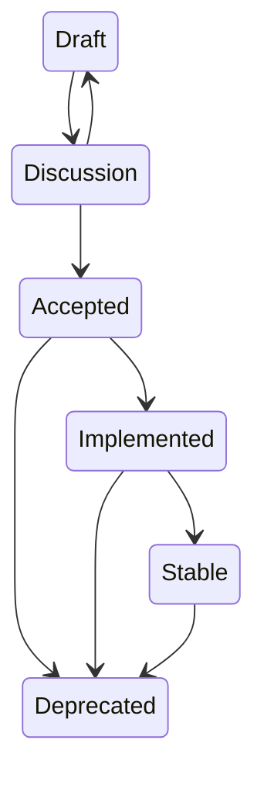

# Proposal Lifecycle

## Purpose

This document defines proposal lifecycle stages, legal transitions, prohibited transitions, and minimum artifact-level gates.

It does not define governance authority, approval bodies, voting rules, implementation behavior, or framework architecture.

Acceptance authority is intentionally deferred to a future governance specification.

## Statuses

- Draft
- Discussion
- Accepted
- Implemented
- Stable
- Deprecated

## Legal Transitions

- Draft -> Discussion
- Discussion -> Draft
- Discussion -> Accepted
- Accepted -> Implemented
- Implemented -> Stable
- Accepted -> Deprecated
- Implemented -> Deprecated
- Stable -> Deprecated

## Prohibited Transitions

The following transitions are prohibited unless a future governance specification changes them:

- Draft -> Implemented
- Draft -> Stable
- Discussion -> Implemented
- Accepted -> Draft
- Stable -> Draft
- Deprecated -> Stable
- Deprecated -> Accepted

## Draft Gates

A VDP may be marked Draft only if:

- YAML front matter exists.
- All required metadata fields exist.
- The document validates against [VDP metadata schema](../schemas/vdp.schema.json).
- Abstract, Motivation, Goals, and Non Goals exist.
- Unresolved content may contain TODO markers.
- Open questions may remain.

## Discussion Gates

A VDP may enter Discussion only if:

- Draft gates pass.
- Problem Statement is present.
- Proposed Design is present.
- Alternatives Considered is present.
- Security Considerations is present.
- Performance Considerations is present.
- Open Questions are explicitly listed.
- Any placeholders that remain clearly identify unresolved content.

## Accepted Gates

A VDP may be marked Accepted only if:

- Discussion gates pass.
- No unresolved TODO markers remain in normative sections.
- Normative Requirements exist.
- Validation Strategy exists.
- Compatibility is addressed.
- Migration is addressed or explicitly marked not applicable with rationale.
- References are supplied where external standards are invoked.
- All known open questions are resolved or explicitly deferred.
- Required reviews are complete, though reviewer authority is governed elsewhere.

## Implemented Gates

A VDP may be marked Implemented only if:

- It is already Accepted.
- Implementation evidence is linked.
- Validation evidence is linked.
- Known deviations from the accepted design are documented.
- Implementation status is not inferred merely from code presence.

## Stable Gates

A VDP may be marked Stable only if:

- It is already Implemented.
- Validation has been completed.
- No unresolved critical deviations remain.
- Compatibility and migration statements reflect actual implementation.
- Operational or usage evidence exists where applicable.

## Deprecated Gates

A VDP may be marked Deprecated only if:

- The rationale is documented.
- Replacement or superseding proposals are identified when they exist.
- Migration guidance is provided where applicable.
- `superseded_by` is populated when a direct replacement exists.

## Deprecation Behavior

Deprecated proposals remain part of the record.

Deprecation does not imply deletion.

## Normative Amendments

When a normative amendment begins:

- The working revision enters Discussion.
- The latest previously Accepted revision remains authoritative.
- The amended revision becomes authoritative only after acceptance.
- Tools must distinguish working and authoritative revisions.

## Withdrawal Convention

Until a formal disposition field or Withdrawn status is defined, retained withdrawn proposals use:

> **Disposition: Withdrawn**

A withdrawn Draft must not be treated as active solely because metadata says Draft.

This convention is transitional. Do not add Withdrawn to the status enum until a future specification defines it.

## Notes

These gates are minimum artifact requirements only. They do not define approval authority.
